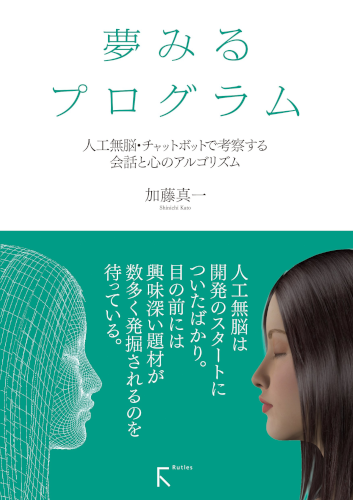

## 夢みるプログラム

* 著者: 加藤真一 
* 価格:2,376円(本体2,200円+税) 
* 出版: (株)ラトルズ (2016-08-25)
* A5 184ページ / ISBN: 978-4-89977-454-9 

[Amazon](https://www.amazon.co.jp/gp/product/4899774540/ref=as_li_tf_il?ie=UTF8&camp=247&creative=1211&creativeASIN=4899774540&linkCode=as2&tag=jinkoumunouha-22) | [Kindle](https://www.amazon.co.jp/%E5%A4%A2%E3%81%BF%E3%82%8B%E3%83%97%E3%83%AD%E3%82%B0%E3%83%A9%E3%83%A0-%EF%BD%9E%E4%BA%BA%E5%B7%A5%E7%84%A1%E8%84%B3%E3%83%BB%E3%83%81%E3%83%A3%E3%83%83%E3%83%88%E3%83%9C%E3%83%83%E3%83%88%E3%81%A7%E8%80%83%E5%AF%9F%E3%81%99%E3%82%8B%E4%BC%9A%E8%A9%B1%E3%81%A8%E5%BF%83%E3%81%AE%E3%82%A2%E3%83%AB%E3%82%B4%E3%83%AA%E3%82%BA%E3%83%A0%EF%BD%9E-%E5%8A%A0%E8%97%A4-%E7%9C%9F%E4%B8%80-ebook/dp/B01MTL5PXU/ref=tmm_kin_swatch_0?_encoding=UTF8&qid=&sr=)

話し相手になる機械、心を持った人工物。その登場を人類は古代から絶えることなく渇望してきました。コンピュータと人工知能の技術が進むにつれ、それらはいよいよ現実になるかと人々を熱狂させています。しかし、これまでのところ人工知能の研究は、心を持ち人間と交流できる存在を生み出せてはいません。 本書は、99年に「人工無脳は考える」という考察サイトを立ち上げ、以来17年に亘り ユーザーと雑談するという複雑な精神活動を極めて単純なアルゴリズムで実現しようとする“人工無脳”の研究に取り組んできた著者による、科学・非科学の壁に囚われる ことなく想像力豊かに、人とコンピュータとの会話について考察する書籍です。

本書では、簡単なPerlプログラミングを習得した読者を対象に、人工無脳の歴史と日本語の人工無脳で代表的な辞書型人工無脳とログ型人工無脳のアルゴリズムを分かりやすく説明した後、どのようにして人工無脳の会話の質を高めるかを、実際に人工無脳を改良しながら検証していきます。最終章では行動心理学を最初の足がかりとして、初期の仏教や潜在意識の世界に踏み込み、心のメカニズムについて述べた知見を 紹介。それらを人工無脳的に解釈し、システムを考えた最初のステップも紹介します。 

