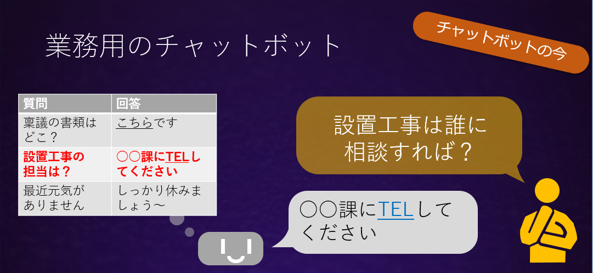
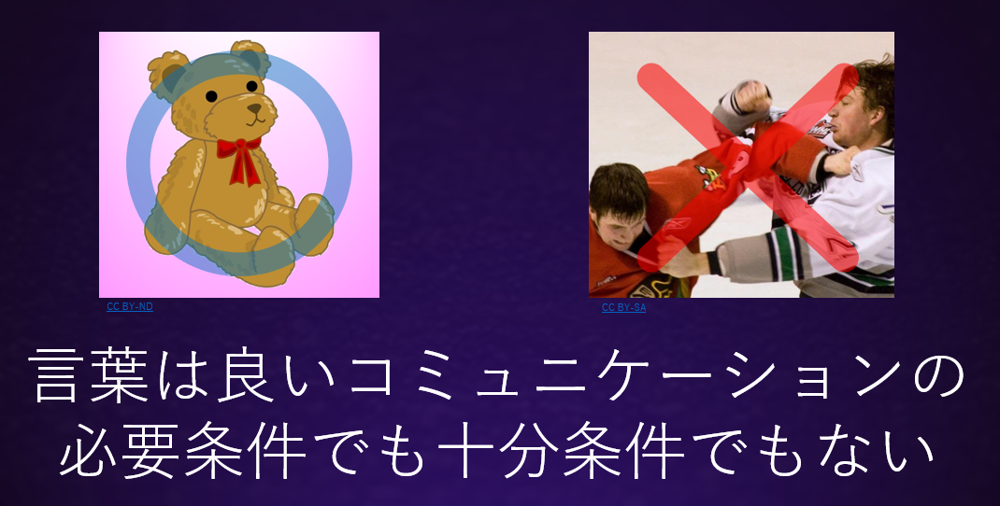

チャットボットはユーザと会話を行うアプリケーションで、**人工無脳** や **人工無能** というニックネームでも呼ばれていました。
会話を行うと言っても日本語や英語のような自然言語の意味を理解することはコンピュータにとって非常に難しいため、最先端の人工知能技術を使ったとしても「会話しているように見える」程度のチャットボットしか作れません。会話にはコンピュータにとって簡単なものと難しいものがあります。事務的な問い合わせに一問一答で答える会話は最も簡単な方で、様々な企業のサイトですでに使われています。

業務用のチャットボットでは人間が用意した業務に関する想定問答集を用い、チャットボットはユーザから入力文字列を受け取ると、それに近い質問が書かれている行を問答集の中から探して、その行の回答を出力する、という方法で問い合わせに答えます。業務の分野も、答えるべき内容も具体的に限定されているので業種を問わず、比較的簡単にチャットボットを導入できます。  

一方雑談は最も難しい会話です。業務用の会話と比べると、雑談は相手がしゃべる話題の範囲は果てしなく広く、季節の話、ニュースネタのように鮮度が問われる話題や誰かのゴシップのように文脈性が非常に強い会話が求められます。このような極めてハードルの高い会話であるにもかかわらず、雑談の中で交換される情報そのものにはほとんど意味がないことがよくあります。例えば

>A: 今日はいい天気だね  
>B: きっと山に登ったら気持ちいいですよ！

の場合、天気がいいことはわざわざ問い合わせなくともその場にいる人間ならわかっていることです。では何故我々はこのような会話を欠かせないと感じるのでしょうか。実は、雑談においては情報よりも感情のやり取りが重要なのです。そこで雑談用のチャットボットでは、雑談を**感情面を含めたコミュニケーション**として捉えることが重要です。ここで、小さな女の子はことばを喋らないクマのぬいぐるみとお話でき、彼らの中ではコミュニケーションが成立します。一方喧嘩中の相手とでは雑談ができません。大人同士で言語が理解できているにもかかわらず、です。このことから、言語はコミュニケーションにとって、必要条件でも十分条件でもないということができます。

ここから

>雑談 ー　言語 ＝ :question:

という関係を考えることができます。:question:には一体何が含まれ、それは言語と比べて大きいのでしょうか。小さいのでしょうか？  

この議論の出発地点は想定問答集に沿って返答するだけの単純なシステムでした。しかしコミュニケーションとはなにか、ということを考えてみた結果、極めてエキサイティングで奥深い世界が広がっていることを感じていただけたでしょうか。　　

もしかすると、雑談用のチャットボットは不完全な言語能力しか持ち合わせなくても、人間と良いコミュニケーションができるかもしれないのです。  

このサイトではこのようなロマンを追い求め、心をめぐる様々な議論を吟味していきます。ときには検証不可能なものも取り上げます。ときには人の心にとどまらず、動物をの心についても触れます。チャットボットにとっては、ユーザとの良いコミュニケーションにつながるかどうか、ユーザがどう受け取ったかだけが指標であり、それらの理論が検証されているかどうかは問題ではないのです。  

それと並行して、当サイトでは様々な議論から得た着想をもとに実際に動作するチャットボットを製作します。チャットボットには言葉を教えてその反応を感じられるというユニークな特徴があります。それ自体が面白い体験なのですが、心理学的にはユーザがユーザ自身の考えや言葉を客観的に見つめ直すことにつながり、それが発達障害を持つ子どもたちの助けになるかもしれないと考えている研究者がいます。チャットボットにより、コミュニケーションが苦手な子どもたちが友達を作れるようになったら・・・それもまた、当サイトが追い求めるロマンの一つです。
