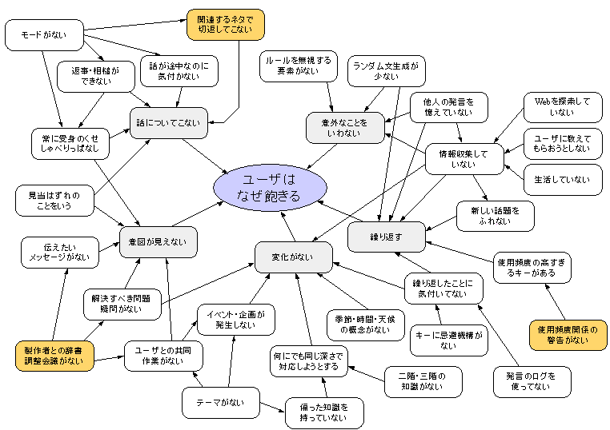

人工無脳を考える上で、『ユーザはなぜ飽きるのか』という問題を解決することが一つの大きな柱になっています。これまでにもいくつもの情報や対策が打ち出されてきましたが、それらは複雑に絡み合って混沌とした状況になっています。そこで、TQC(Total Quality Control)で用いられる連関図を使って状況の整理をしてみました。

矢印は「なぜなら」を意味しています。 この図を見て、何か新しい枝を考えついた方は是非実装してみてください。こっそり教えていただけるともっと嬉しいですが。
