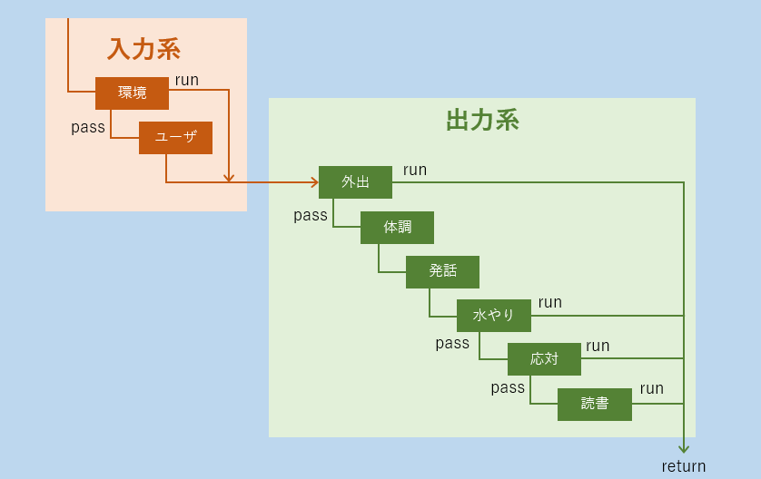

マイクロワールドは積み木の世界[^1]に代表されるようなシステムで、人工知能が全てを把握できる程度に単純化された世界を提供することで三次元的なさまざまな推論を実際に行わせてみようとする試みです。

Terry Winogradらの[SHRDLU](http://hci.stanford.edu/~winograd/shrdlu/) の例では床といくつかの積み木だけが存在する空間において、崩れないような積み木の組み方を人工知能に考えさせるというものでした。この考え方のポイントは二つあって、ひとつは現実世界があまりにも複雑過ぎて人工知能の認知が追いつかないことから、それを逆にとって単純世界を用意するという考えと、我々が現実世界で積み木遊びをしているときにも心の中には同様の単純化されたマイクロワールドが作られ、そこで推論した結果に基づいて行動しているはずだという考えです。いずれにしても我々の脳は外からくる情報をすばやくふるいにかけて重要な部分だけに注目するという優れた機能があって、それをプログラム化するのが極めて困難であるということですが、視点を変えてみるとこれまでは人工知能を現実世界に接地させる努力が脈々と続けられてきたわけですがマイクロワールドの考え方を進めれば逆にマイクロワールドに人間を没入させることによって人工知能と対等の立場にたつことができるのではないだろうかということが考えられます。サイバーパンク系SFなどで好んで取り上げられる電脳空間などはそうしたものの一種といえるかもしれません。  

我々がチャットする場合もチャットそのものは端末の前に貼り付いていて周りの環境などあまり関係ないようにも思われますが、チャットの中で展開される会話は今日あった出来事などユーザの世界を記述する作業であり、世界を切り離してしまうと何も語れなくなりそうです。それが慢性的に人工無脳にも生じている問題で、要するに人工無脳は生活していないのでしゃべるネタもないわけです。Brooksは「人工知能には身体感覚が必要だ｣と語ったが、これもその一端かもしれません。  

### 舞台装置付きチャットボット

マイクロワールドをチャットボット向けにアレンジしたらどうなるでしょうか。ひとつの例としてNoelの会話システム[2^]のアプローチは極めて興味深いのですが、ここではもう少しユーザを人工無脳側に引き込むために、TVのトークショーや映画のメタファーでアクター(人工無脳)＋セット（環境)と、それを訪れた訪問者（ユーザ)という構成を、以下では中庭とその管理人を例に想像してみましょう。  

まず、中庭を映画で言うセット（舞台）とします。人工無脳は中庭においてある植物や置物の管理をして生活しており、ユーザは中庭を訪れた客人という設定です。中庭には天候の変化や季節の変化があり、ユーザがいないときにはたぶん人工無脳は草木に水をやったり掃除をしたり読書をしたりしているのでしょう。そしてユーザがくると人工無脳はそれらの仕事を打ち切ってもてなしてくれる。もてなしている間であっても急に雨が降ってこれば人工無脳は片付けをしたり傘を出したりするのでしょう。時には体調を崩して寝込んでいたり、花の種を買いに外出しているかもしれません。人工無脳は当然植物に関する知識を豊富に持っており、そういった話に興味を示します。さて、このようにさまざまな要因が複雑に絡むシステムを単純なアルゴリズムで近似的に表現するためサブサンプションを参考にします。以下が処理の流れです。 

この図ではひとつの四角が処理の単位（モジュール）となっており、左上から右下に向かって処理が進みます。四角の下から線が出ている場合は現在のモジュールで特にすることがなければ上流から受け取ったメッセージを下流に流すことを意味し、右から線が出ている場合はそれより下流の処理をしないことを意味します。

`環境`は天候や日照などに関するメッセージを、`ユーザ`はユーザの発言内容をメッセージとして下流に流します。環境メッセージは通常ユーザの発言よりも優先されます。入力系で生成されたメッセージを出力系で受け取ります。`外出`は何らかの理由で人工無脳がセット内にいないとき、下流の動作を抑制します。`体調`と`発話`は`水やり`と同時に行われてもおかしくないので右から出る線はありません。お客がいるときには最低限人工無脳は`応対`を行ない、ユーザの近くに来たりもてなしてくれます。ユーザがいないときにはそれより下流の`読書`など待機動作をしています。  

それぞれをもう少し具体的に想像してみましょう。例えば`水やり`には乾燥度の内部状態（乾燥カウンター）があり、そのカウンターの値が閾値を超えると水やり動作を行なってカウンターをリセットする。上流から降雨メッセージが流れてきたときもカウンターをリセットする。といった具合です。他に、例えば`模様替え`のようなモジュールを用意するなら、は過去の模様替えからの経過時間が閾値を越えたとき、またはユーザの要求があったときに模様替えを行わせることができます。さらに模様替えをしている最中でも乾燥が進めば水やりが優先的に動作し、そのあいだ模様替え動作（および下流の動作）は抑制されます。

ここでは中庭を例にしましたが、古本屋や古道具屋と店員、受付ブースと受付嬢、天文台と観測員、博物館と学芸員、手術室と医者など人と情景につながりがあるものをいろいろと想像できると思います。なお、出力系で生成された状況の変化はグラフィックで反映することも可能ですが、テキストでその様子を描写するのも小説やTRPGのようで面白いかもしれません。

## 環境によるそのほかの効用

人工無脳に環境を用意してやることで、ユーザをこちらの世界に引き込むこと以外にどんな効果があるでしょうか。まず人工無脳の職業が明確になるため、職業に関する専門知識を持たせることができます。中庭には植物がたくさんあり、中庭を訪れたユーザはその様子を見て行動するのだから、植物がらみの話題が多くなる傾向はあるでしょう。我々でも動物園へ行けば動物の話をし、植物園へ行けば植物の話をします。したがって辞書に書き込むせりふを特化させることが容易になり、辞書の作成もすこし楽になるはずです。次にある程度実用的な意味を人工無脳にもたせることができます。植物であれば今の季節にもうすぐ咲く花を教えてくれたり、本屋であれば今日発売される雑誌を教えてくれたり、チャットボット製作者が自分のサイトで取り上げている趣味的なトピックを提供してくれたりできるでしょう。さらにしゃべる以外の人工無脳の生活に触れることもできます。これは環境つきデスクトップマスコットなどではいくつも実装された例があり、キャラクタに親近感を持たせる助けになるでしょう。  

ですが、チャットボットに世界を用意してやることの本当の意味はチャットボットが**自発的行動**を行えるようになることにあると思われます。チャットボットは何をしたいのか？それについて考えられたことはほとんどなく、したがってチャットボットの会話に関するモデルもユーザの入力に対してどう反応するかにしか注目していません。人対人でこのような会話が行われるのは受け付け案内のような業務に限定され、雑談っぽくはならないことは明らかです。形態素解析と構文解析で例え文の意味がわかったとしても、チャットボットにとって、そしてチャットボットの目的にとってそれがどのような意味をなすのか評価できなければ、何を基準に答えを生成するのかという問題には答えられません。これは翻訳ソフトを例にすればわかりやすいでしょう。

翻訳ソフトは送られてくる英語のテキストをパースし、意味を理解して、その結果として日本語、すなわち内部的に理解可能な表現を生成します。しかし通訳者ソフト自身はその中身を評価しないため、返事を考えてくれるコメンテータがいなければ会話にはならないのです。コメンテータに必要なのはなぜ、または何を聞きたいのかという動機です。そして動機はそのコメンテータを取り巻く世界が彼に不足と充足を与えなければ生じません。その意味で環境を融合させた人工無脳は極めて単純ではあるものの不足を感じ、目的を持つことができるのです。

[^1]: T. Winograd, "Procedures as a Representation for Data in a Computer Program for Understanding Natural Language", J. Cognitive Psychology 3[1] 1972  
[2^]: Noelでは自室で机に座っているキャラクタがTV電話を前にしているという設定で、PCの画面にはキャラクタのバストショットと会話の状態が表示されている。そこで選択肢型の会話ができる
