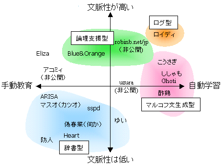

  
最近の人工無脳の能力の、独断に基づいた分布を示す。横軸は学習能力、縦軸は文脈追跡能力を示している。近年この勢力図は大きく変わった。マルコフ文生成を行なう人工無脳の一派の台頭と、限定的ながら論理を追跡して会話に反映させる人工無脳の技術の出現である。かつて人工無脳の代名詞と考えられていた辞書型はいまや旧世代のアーキテクチャに属し、その範疇では新しい技術開発が停滞している模様である。ログ型アーキテクチャは以前から存在していたのだが、いつの時代にもあまり大きな勢力にはなっていないようである。これらの情勢の変化はマシンパワーの増大と人工無脳業界への形態素解析器の導入に伴って生じたと考えられる。以下に各人工無脳の特徴を簡単に述べる 

## マルコフ文生成型

マルコフ連鎖を用いて文を生成する。後述の辞書型人工無脳は辞書を拡大することでよい反応をするようになるが、マルコフ文生成型は逆で、生成する文の質はどれだけソースの辞書を小さくできるかにかかっている。形態素解析器によって言葉を細切れにしすぎても同様に文の品質低下を招く。この型の人工無脳は人名ではなく無人格的な名前を与えられていることが多い。マルコフ連鎖で文をつぎはぎする結果人工無脳のキャラクタ性が低い、という特徴を反映しているようで面白い。 

### ししゃも

ログの中からいくつかの返事候補と思われる文をふるいにかけて選び出し、それをもとにマルコフ連鎖で返答を生成する。ししゃもで興味深いのはマルコフ連鎖でいくつもの文を生成しておき、もう一度ふるいにかけて返答としての精度を高めている点にある。マルコフ連鎖の弱点を補ううまい手法であると考えられる。

### 人工無脳エンジン Ghoti 

[人工無脳エンジン Ghoti ](https://www.oocities.org/svnseeds/ghoti/ghoti.html)
ユーザの入力した文字列の中から名詞または感動詞を取り出し、キーワードとして蓄積しておく。返答するときは最近のキーワードや関連するキーワードをひとつを選んで、それを先頭にマルコフ文生成を行なう。ログに含まれる文脈性を少しだけ利用している。

### 人工無脳 酢鶏

IRCのログ、ニュースなどをソースにマルコフ文生成で発話する。ニュースのテキストは量も手ごろでタイムリー感もあり、マルコフ連鎖に食わせるにはちょうどよい食材だと思われる。さまざまなweblogサービスなどに出張する方向に展開しているが、人工無脳の能力向上には関係ないようである。ソース非公開？ 

## ログ型

### 人工無能ロイディ

ログを検索し、ユーザ発言に似た文の次の行を返答のベースにする。このベース文に現れる既知の単語をユーザ発言に含まれる単語に適当に置き換える。ここでユーザ発言を使うことで人間の連想に似た効果が得られていると思われる。また、既知の単語が見つからない場合に無理してしゃべろうとしないのも理解しやすい。会話における人間の挙動をよく観察した結果に基づいて作られているという印象を受ける。

## 辞書型

辞書を使って文を生成する。教育システムとの兼ね合いを考えておけばキャラクタ性を維持することができる。反面、辞書を作る作業があまりに大変なため、実際に作りこむに至った人工無脳はなかなかない。 

### 人工無能ARISA

今となってはやや旧世代に属する、辞書型のアルゴリズムを突き詰めた人工無脳。タグ展開を利用して即興性のある文を生成した。タグ展開辞書をきちんと作りこむと、分野によってはマルコフ連鎖よりも面白い文を生成することがある。 

### 人工無能マスオ

人工無能 カツオはかつて代表的人工無能であった。マスオはその後継機である。アルゴリズム的にはARISAとほぼ同じ。 

### Chararina

かつてペルソナウェアと呼ばれたデスクトップマスコット。春菜という名前で知られた。会話はユーザに選択肢を選ばせることによって進行するため、即興性はあまりない。新しい話題を配信することで人工無脳の単調さを避けるという画期的な仕組みを持っている。フリーウェアとして出発したが、のちに開発者ごと商業ベースに組み込まれた。商業化によって必然的に偽春菜（後述）を排除する方向に動き、このあたりの時期からユーザのコミュニティが縮小した。

### 伺か

かつて偽春菜、任意、何か、など様々な名前で呼ばれたデスクトップマスコット。自然言語によるユーザとの対話は行なわないが、キャラクタに相方がいる点が興味深い。人工無脳の会話は一方通行であることが多いが、固定の相手を用意することでかみ合った会話をしているふりができ会話として自然な味わいがある。そのほか相方によってキャラクタの世界感が奥行きをまし、ユーザが第三者的立場になることから精神的負担が少なくなるところも注目すべき点である。もともと春菜のアンチテーゼとして立ち上げられたプロジェクトであるが、一部のアルゴリズムは春菜を凌ぐといってよいだろう。春菜との係争を含めた開発者の作家性が多くのユーザを惹きつけた。 

### 掲示板的コトバ宇宙「-宙」の防人

それほど口数は多くなく、ユーザと関係ない独り言に近い。発話のパターンは決まっており、アルゴリズムとしては偽春菜に類似。ただし「-宙」の防人は『教育テレビ』と呼ばれる独特の教育システムを持っている。これはユーザが穴埋め式の質問に答えることで、嫌いなもの、好きなもの、美味しいもの、などのデータを獲得していく仕掛けである。面白いのはこの教育テレビがたまにしか実行できないところである。常に教育テレビが呼び出せたらユーザはすぐにネタ切れになるが、たまにであれば気分によって色々と違う答えを用意することができる。開発自体は終了しているようで、稼動はしているが発展はない模様。

### Heart

ほどほどにシナリオ重視なスクリプトによって知能表現を目指している．ペルソナが多機能化を目指しているのに対してこちらはグラフィックが使えることをのぞいてチャットと代わらない．ネスティング可能な文法で複雑なやり取りが表現可能であるが，途中から別の文脈に飛ぶことができないので意外とレールが一本道になる．

### はにわにわとり

人工無脳の生活感をテーマに、簡単な箱庭環境のなかに辞書型人工無脳を住まわせた構成をとっている。それだけではなくニュースや書籍など外界から情報を色々取り入れる試みもなされ、箱庭環境にあわせて人工無脳が行動するなど実験的要素が満載である。いまはそれぞれの機能をとりあえず並べた段階であるが、いずれ有機的な一体感が現れれば面白くなると思われる。人工無脳が鶏の姿をしているわけではない。

## 論理支援型

### AI-COM CLUB "BULE" & "ORANGE"

ユーザから得た情報を蓄積し、聞かれたら憶えていることをしゃべる、と言う機能に特化した人工無能。「私は○○のことを○○○とおもう」のようにユーザはダイアログの穴埋めをするようになっており、人工無能としては自然言語の解釈を行なわない。そのぶん限定した範囲で意味を理解した挙動ができることとなり、今後の可能性が期待される。

### 20Q

ユーザに様々な質問をし、ユーザが心に思い浮かべたものを言い当てる、というプログラム。エキスパートシステムの応用だと思われる。ユーザに許された入力は基本的にYesからNoまでの数段階の選択のみ。対話というよりは言葉当て遊びなのだが、思わず応援したくなってしまう健気さがよい。近年シンプルな構造のロボットに適当な会話機能を載せて、客に過剰な期待をさせてしまうトイが幾つも発売されている。これはそうした期待になんとか答えようとした模索の一例であろう。 

## その他

### Eliza

ユーザ発言に含まれる構文に着目し、「(A)なので嬉しい」に対して「(A)でよかったですね」などの返答を行なう。一つ一つの記憶のストライクゾーンが広く、話の内容よりも流れをコントロールする。オリジナルのElizaはロジャース派のカウンセリングを模倣するように作られている。積極的傾聴に特化した人工無脳である。数ある人工無脳と比べてElizaが驚異的なのは、「どうやって返答するか」ではなく「会話を通じてユーザに心情を吐き出させる」という、ひとつ高いレベルからの設計がなされているという点にある。1966年生まれ。 

### 人工無能うずら

以前推測でアルゴリズムについて適当なことを書いたら速攻でツッコミのメールがきた。
