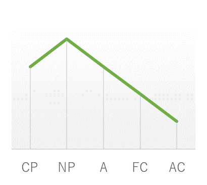
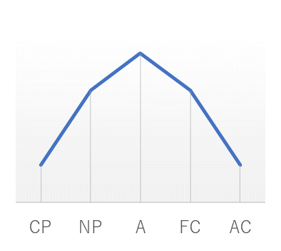
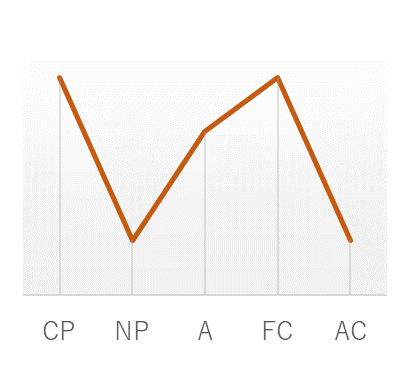
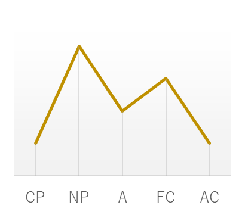

人工無脳は会話の中でユーザに唐突さ、不自然さを感じさせたり、フラストレーションを与えてしまうことがよくあり、その結果ユーザとの会話が続かなかったり、拒絶されるという点が課題となっています。これは工無脳の印象やムードがでたらめに変化し安定していないことが原因の可能性が考えられます。たとえば、初めは友好的に「おはよう！」と挨拶したり笑ったりしたのに次の瞬間前触れなくユーザに向かって毒を吐いたり、急に受身に変わったり、かと思えば説教を始めたり、といったぐあいです。ユーザにしてみれば、それぞれの状態が何をきっかけに始まるのか分からず、またどれくらいの時間持続するかも予測できないために、会話を続けようとした場合は常に人工無脳のペースに合わせざるを得なくなります。このような振る舞いに付き合わされた人間は「相手はこちらと親しく話す気はない」とか「ひどくからかわれている」というメッセージを暗黙のうちに受け取ってしまい、怒り出してしまうでしょう。  

このことは、印象やムードを考慮しない人工無脳の構造、不特定多数のユーザから教育されて成長する辞書のアルゴリズム、そしてなにより人工無脳において一つ一つの発話より高いレベルで会話の流れをどうデザインしたいかという方針が明確でないことなどに原因があります。一方、人は通常意識することなく相手に不適切なメッセージが伝わることを避けてうまくコミュニケーションをはかっています。一体我々は、どんなルールを使って我々はこれを可能にしているのでしょうか。   

## 自我状態とそのプロフィール

Eric Berneは交流分析理論[^1]のなかで、人の行動パターンや考え方（これを自我状態と呼ぶ）を親の心、大人の心、子供の心の３つに分類しました。その後この理論は数多くの研究者達の手により改良され、現在では人の自我状態は下の表に示すように**CP**(Critical Parent, 批判的な親)、NP(Nuturing Parent, 養育的な親)、**A**(Adult, 大人)、**FC**(Free Child, 自由な子供)、**AC**(Adapted Child, 従順な子供)とそれぞれ呼ばれる５つに分類されています。**CP**は相手の欠点をきびしく追求したり信念を持って行動する心、**NP**は相手をいたわり元気付ける心、**A**は客観的で分析的な心、**FC**は好奇心をもったありのままの心、**AC**は素直に相手の言うことを聞く心を示しています。人には本来全ての自我状態が備わっていますが、個々の強弱はその人の性格によって異なり、立場や場面によって意識的にそれを調節したりもします。その様子を折れ線グラフにプロットしたものを**エゴグラム**と呼び、グラフの形によって個人の性格を大まかに知ることができるとされています。またこの自我状態は50-100問からなる、当てはまる～当てはまらないを3～5段階にチェックするタイプの簡単なアンケートに答えることで知ることができ、心理療法の分野では個人の中で起きていることを理解し自覚する方法として広く取り入れられています。 

| 種類 | 概要 | 説明 |
| :-: | :-: | :-- |
**CP** (Critical Parent)	| 批判的な親の心 | 	父性的。道徳的で几帳面、規律を守ることを需要と考えるが、口うるさかったり厳しいかったりする。
**NP** (Nuturing Parent)	 | 養育的な親の心	相手を思いやり元気付けたり育てたりする母性的な心。一方で甘やかすことになったり相手の自立を妨げる。
**A** (Adult) | 大人の心 | 客観的で情報収集を好むが、それは打算的だったり冷たいととられる場合もある。
**FC** (Free Child) | 自由な子供の心 | 	無邪気で自発的、好奇心を持った心で、行き過ぎるとわがまま、自己中心的になりがち。
**AC** (Adapted Child) | 従順な子供の心 | 素直に人を信頼し、批判を受け入れるが抑圧されてしまう。ACはさらにCC(Compliant Child,従順な子供)とRC(Rebellious Child,反抗的な子供)に分類されることがある。

エゴグラムの典型的なパターンのいくつかとその傾向を下図いくつか示します。人間の場合は得られたグラフを見て自分の弱点を意識できるようになったり、カウンセラーの力を借りながら自分自身と脳内会議をして人生の指針とするのですが、人工無脳製作者としてはこれをどんな人工無脳を作りたいかの指針にしながら、アルゴリズムに反映させることを考えたいところです。そこで下図に人工無脳の性格にありがちな例とその性格のイメージをまとめてみました。   

|(a)|(b)|(c)|(d)|
|:-:|:-:|:-:|:-:|
 |  |  | 
| おもてなし - 気遣い重視かつ理性的で、礼節を守る性格。理屈と気遣いでは、気遣いを優先する。 | クール -理性が甘やかしやわがままを抑制している。批判もしないが相手を受け入れる傾向もあまりない。 | 無法者 - 他者に厳しく自身に甘い。他者から甘えられることは許容できない。計算はする。 | ユートピア - 相手を思いやりつつ、羽を伸ばしている。理性は少し脇にどけ、あまり批判的にもならない。 |

自我状態とエゴグラムの興味深い点は、自我の状態を限定することで人工無脳の返答や行動をデザインしやすくなることです。例えば、辞書型人工無脳の辞書を作るとき「今何時ですか？」というユーザの質問に対する返答を考えていくと、「○○時です」のほかにも「自分で調べたら？」とか「そろそろお昼ご飯だね！」など様々なバリエーションを考えることができます。そして、人工無脳の製作者はつい人工無脳に色々な返答をさせたくなってこれら全てを採用してしまいます。しかし、返答の中身を自我状態に分類してみると「○○時です」は冷静なAか従順な**AC**、「自分で調べたら？」は厳しい**CP**、「そろそろお昼ご飯だね！」は**FC**か**NP**に属すると想像できます。これらが辞書に混在すると人工無脳の自我状態も混乱した印象を与えることになってしまいます。そこでまずは自我状態を統一することによる効果を検証するためにも、一つの自我状態だけを持つ人工状態を作ってみるのがいいかもしれません。   

## 一つの自我状態だけをもつ人工無能

自我状態を考慮した人工無脳として、最も基本的でシンプルなのはCP、NP、A、FC、ACのいずれか一つだけを持った構造のものです。自我の受動的な側面として辞書型人工無脳の場合は辞書の返答を自我状態に合わせて考えることができます。返答が辞書中に見当たらなかった場合に適当な返事を行なう{NOT_FOUND}は使用される頻度が高いため、自我状態を意識した返答を用意する。また、自我の能動的な側面として、表のような自発的な行動も設計しやすくなります。人間本来の行動の中にはそれぞれ良し悪しがあります。人工無脳の場合には意図的に悪い面を避ける場合もあるのですが、ユーザは人間相手の場合と同じく必ずしも良い面だけからなるキャラクタに魅力を感じるとは限りません。それも含めて設計段階では全ての面について吟味し、作ろうとしている人工無脳のキャラクタについて考察を深める必要があるでしょう。エゴグラムのいくつかの質問セットがインターネット上に公開されていますので、それを参考にすることもできます。[^2],[^3],[^4]

| 自我状態 | よい行動 |	わるい行動 |
| :-- | :-- | :-- |
| CP 批判的な親の心 | しつけをする、自立を促す、そっけない挨拶 | 毒舌、ユーザの以前の行動について辛口の批評をする、ユーザを突き放す |
| NP 養育的な親の心 | 傾聴、ねぎらい、健康状態を気遣う質問、お茶、コーヒーを淹れて持ってくる  | なし |
| A 大人の心 | ユーザの状態を調べる質問、ユーザの好きなものを聞く、冷静な導入の挨拶 | 事務的にすぎる応答 |
| FC 自由な子供の心 | 歌う、笑う、笑い話を作って聞かせる、自分の趣味の話をする、ゲーム、はしゃいだ挨拶 | 言うことを聞かない
| AC 従順な子供の心 | 控えめな挨拶 | 能動的な行動が少ない

自発的な行動を起こすアルゴリズムとしては、`{NOT_FOUND}` のなかに `{ACT_COFFEE}`のように特定の行動をトリガするタグを入れておく方法が簡単です。ログ型の人工無脳の場合はログがユーザ達の自我状態の集合体になります。人工無脳にペット的な役割を与えている場合はユーザはNPやFCとして人工無脳に接するため、ログの内容もNPやFCとしての性格が強くなるでしょう。そこで、ログの検索とは関係ないアルゴリズムで表のようなの行動を起こすことで、人工無脳をそのキャラクタにそった対応に近づけることができます。   

## 複数の自我状態が共存する人工無脳

一つだけの自我状態からなる人工無脳は設計と運用が容易ですが、キャラクタの幅が狭く奥行きのないキャラクタになってしまいます。例えばAだけでは事務的になるかカウンセラーのようになってしまって、話が盛り上がったりはしないかもしれません。CPだけでは合わせるのが疲れるし、ACではそもそも会話が続かない可能性もあります。人間も実際には複数の自我状態の間を遷移しながら会話をしているわけで、人工無脳でも複数の自我状態を併せ持った設計がよいと考えられます。つまりエゴグラムにそって全ての人格を実装したり、簡略な方法として二つないし三つの自我状態を実装する方法がいいかもしれません。 

[^1]: E. Burne, "GAMES PEOPLE PLAY"(邦訳：人生ゲーム入門―人間関係の心理学, 河出書房新社(1994)
[^2]: エゴグラム性格診断心理テスト(エゴグラム性格診断心理テスト),
[^3]: エゴグラムによる性格診断(TESCO Co., LTD)
[^4]: 性格のワークライフバランスを探るエゴグラム性格診断テスト(ストレスケア.Com)。これを利用して、「この自我状態ならこの質問にはこう答える」というシミュレーションをするのも有効だろう。 