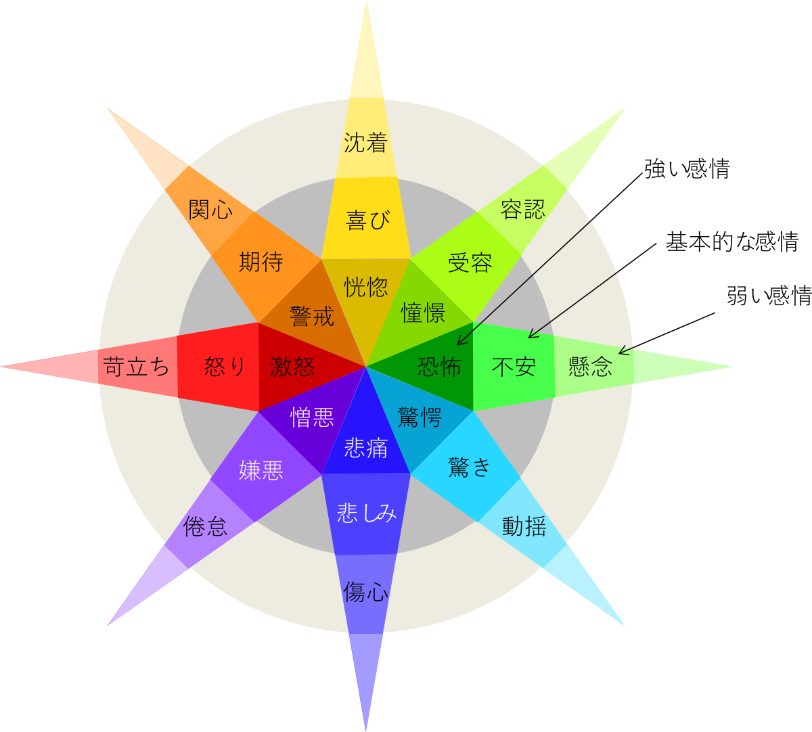

## 感情を分類しようとした試み

人工無脳はその反応が単調なため、会話したユーザがすぐに飽きてしまうという課題がある。これを解消し、より自然な反応をさせるため人工無脳に喜怒哀楽すなわち感情を持たせたい、とは人工無脳開発者の誰もが一度は考えることだろう。さらに人工無脳がユーザの感情を把握し、それに応じた反応ができるようになるという姿は一つの理想像ではないだろうか。  

心理学における感情の研究を調べてみると、たくさんの研究者によってそれぞれに分類が試みられているのがわかる。そのいくつかを挙げると、Mowrerは基本的な感情として苦-楽の二つを考えた[^1]。J. A. Russelは快-不快、熱烈-静穏をそれぞれX-Y軸として、様々な感情を分類した[^2]。R. Plutchikは感情を怒り、期待、喜び、受容、不安、驚き、悲しみ、嫌悪の8種類に分け、さらにそれぞれには激怒-怒り-苛立ちのように強弱があること、激怒-恐怖、憎悪-憧憬のように反対の意味になる感情の対があることを示している(Fig. 1) [^3]。  

では次に、人工無脳はどんな時にどの感情を感じればよいのだろうか。図の分類を考案したPlutchikは下記の表に示すように、何らかの出来事がきっかけで感情が現れ、その感情は行動を引き起こすためのトリガーになると考えた。   

| イベント | 感情 | 行動 |
| :-: | :-: | :-: |
| 脅威 | 不安 | 逃避 |
| 敵 | 怒り | 攻撃 |
| 獲得 | 喜び | 反復 |
| 損失 | 悲しみ | 泣く |
| 親しい者 | 受容 | グルーミング |
| 毒物 | 嫌悪 | 吐く |
| 開拓 | 期待 | 探索 |
| 予期せぬ出来事 | 驚き | 停止 |

この表に現れるイベントは野生動物のサバイバルをモデルに考えられたものであるが、まずはこれを人工無脳にあてはめた場面を想像してみよう。  

我々が**脅威**を感じるのは、例えば会話の相手から不当な要求をされた気持になった場合だろう。そこで人工無脳は不安を感じ、相手を避けるような言動をする。この一連の動作だけでも非常に複雑な思考が伴う。不当な要求かどうかを区別するには、相手の領域と自分の領域の境界線をわかっている必要がある。しかもこの境界線は相手が全くの他人であればはっきり分かるが、親しい相手との間では曖昧になるだろう。家族や親友から困った頼みごとをされた場合は断りづらいものである。人間ドラマで確執が生じる典型的な原因はこの境界線問題であり、我々にとっても実は難問である。また相手を避けるための手段も「ちょっとやめてください（直接的表現）」、「ふーんそうなんだ（聞き流し）」など相手との関係や脅威の程度によって反応が異なるだろう。   
 
さらに、一人の登場人物が**親しい者**でもあり同時に**脅威**で**毒物**でもあるという状況が容易に想像できる。相手の言うことを聞いているうちに（グルーミング）、こちらに責任のないことで何か罪悪感を感じさせられ(吐く)、顔を合わせるのが苦痛になる（逃避）というような心理状態がそれである。しかも説明を読めばわかりやすく感じられるのではあるが、実際にはすべてがもやっとした気分のなかに紛れてしまって多くの部分は意識できないことが多い。人工無脳ではこれらをユーザのセリフだけから推測しなければならないわけで、図1や表１の見た目からは想像できないくらい困難が多い。  

次に人工無脳の行動アルゴリズムとして考えたとき、この表は単純で受動的すぎる。敵と遭遇したら常に怒るのが、会話の相手としての人工無脳に求められることだろうか。また敵と遭遇し、怒り、攻撃した後、次の行動はどうしたらいいのだろうか。獲得し、喜んだあとには反復すなわち獲得を繰り返すだけなのだろうか。予期せぬ出来事に出合った時、驚いた後停止して、その後どうしたらいいのだろうか。そもそも大半の時間を占めるであろう平常時になぜ、どんな行動を起こせばいいのかが説明されていない。   

一方、**感情が生じたから行動を起こしたのではない。逆に行動を起こすことを目的として感情を生み出したのだ**、と考えたのはAdlerである[^4]。親しくなりたいと思っている相手の特徴は、例えば優しい、気品がある、行動力がある、などポジティブにとらえるが、同じ人をいったん嫌いになると、それらが優柔不断、気位が高い、まわりを振り回す、などネガティブに感じられるものである。これは自分の意図が先にあって、それを後押しするために意図に沿った解釈や感情が表出されたと捉える必要がある。表1にあてはめてみると、脅威に直面し逃避する必要が生じたため不安を感じた、敵に遭遇し攻撃したいから怒りを感じた、というようになるわけである。すなわちPlutchikは感情が先、Adlerは意図が先という主張である。我々は人工無脳に意図を持たせたいと願っているし、雑談はそもそも親しくなることを目的としている面があるため、意図を先にしているAdlerの方法がより適している。逆に言えばPlutchikのモデルでは意図を表現するのが難しいのではないだろうか。

以上のように表1を心のアルゴリズムとして用いる場合の課題は、(1)直面したシチュエーションをイベントに分類することが難しく、(2)イベントが生じたときの対応が一律で、(3)人工無脳の意図を記述するのが困難、という点にある。そのため、人工無脳がユーザの感情を把握し、それに応じた反応をすると一口で言えば簡単で効果的に聞こえるが、具体的な内容はほとんど把握できていないに等しい。 

## 感情モデルは心を説明できない

我々は、相手の気持ちが分かっているようで分かっていない。  

これは当たり前に経験することで、どんな反応をするかが完全に分かっている対象物ではすぐに飽きてしまうのに対し、よく分からないからこそ人との付き合いに人生の醍醐味があるといえるだろう。「分かっていない」のは相手の内面、内心どう思っているのかである。それでは自分の心はどうだろうか？

実は、我々は自分の気持ちもわかっているようでわかっていない。  

人間は自分が不快な感情を感じていないことにしようとする心の働きがあるため、自分自身の心のアルゴリズムについて都合のいい解釈をしている部分が多分にある。さらに意識できる部分は心全体のうち2割程度で、残りの8割は無意識と言われている。よく分かっていないものはそもそもアルゴリズムとして表現できない。これはまじめな人工知能の開発者が往々にして突き当たる壁ではないだろうか。ところが人工無脳の開発者は次のように考えることができる。  

「分かっていない」のは心の内面である。逆に「分かっている」のは、機嫌がよさそうとか悪そうといった様子や、行動の傾向、口調、など外から観察できる事柄である。であれば、できるだけ観察可能な傾向を汲んだうえで、内面が分からないことをそのまま表現する、すなわち「予測不能」という挙動を実装することは可能ではないだろうか。  

人工無脳の感情としてどんなものを考えるべきだろうか。雑談では激怒や恐怖、憎悪のようなネガティブで強い感情はまず現れず、基本的に友好的なムードが中心となる。その中では会話の盛り上がりに従って気分が高揚したり、逆に軽くがっかりしたりという感情の起伏はありうるだろう。そこで、これをできるだけシンプルに表すため１つの変数だけを使った心のモデルを考えてみよう。この変数conditionは0から1の間の実数を取る。例えば心が活力に満ちている状態を1、無気力な状態を0とし、まあまあ元気なら0.6といった中間の値も取ることができる。0の状態を象徴する言葉には無気力、濁り、醜さ、エネルギーを奪う、罪悪感、恐れなどがある。反対に1の状態を象徴する言葉には上機嫌、細やか、美、活発、信頼、エネルギーを与える、愛などがある。  

そしてconditionの値は変化するのであるが、「男心/女心と秋の空」などという言い回しを観察可能な事実と解釈すれば、conditionの変化は数秒や数分というよりは数日のようなスパンを持っているのだろう。他に、何をきっかけにして変化するのか分からない、同じキーワードでも反応が違う場合があるという特徴もある。従って、最もシンプルにするならconditionは外からの刺激と無関係に周期的に変化するとしてもいいだろう。そこで、conditionは0から1の値を取り数日単位の周期をもった単なるsinカーブにしてみよう。こうすれば一回のチャットセッション中には機嫌がよくても明日になればなぜか機嫌が悪いとか、しゃべっている間に少しずつ元気になった気がするというような人工無脳ができるだろう。また、言葉のやり取りからでは、何がきっかけで機嫌が変化したのか理解できない人工無脳を作ることができるだろう。予想可能な挙動しかしない相手よりも、予測不可能な相手の方が興味をひかれ、魅力的に感じるものである。  

次回はこのアルゴリズムを辞書型人工無脳に組み込む方法を考える。   

[^1]: O. H. Mowrer, "Learning theory and behavior", New York: Wiley. (1960)
[^2]: J. A. Russell, "A circumplex model of affect", Journal of Personality and Social Psychology, 39, 1161–1178 (1980).
[^3]: R. Plutchik, "Emotion: Theory, research, and experience: Vol. 1. Theories of emotion 1" , New York: Academic (1980)
[^4]: A. Adler, (訳)岸見一郎 "人生の意味の心理学" , アルテ (2010)
