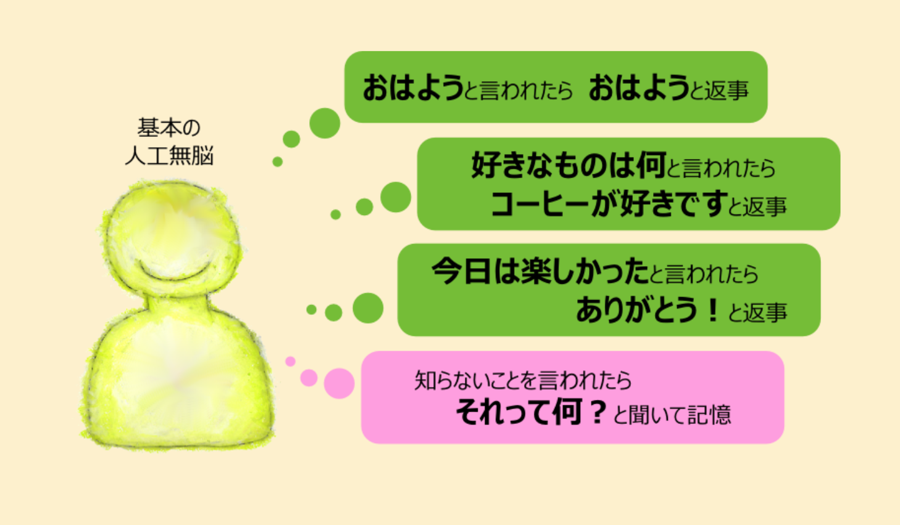

## 辞書型チャットボット
前回、plutchikの感情と行動のモデルを雑談にあてはめようとすると

1. イベントへの分類困難
1. 画一的対応、
1. 意図の不在

といった問題があることを明らかにしました。次に人間同士のコミュニケーションであっても我々は相手の気持ちが分かっているようで分かっていないのですが、それには人との付き合いを豊かなものにする一面もありました。これらを踏まえ、周期的に変動する1つのパラメータを用い、ユーザの感情や反応と無関係に人工無脳の挙動が変わるというモデルを考えました。そこで今回は辞書型人工無脳自体について簡単に説明し、前述のモデルを組込む方法を検討します。  

辞書型人工無脳は、おはようと言われたらおはようございますと返事する、というオウムや九官鳥のような方法で会話します。辞書にないことを言われたら～って何？と聞き返して返事を記憶し、次に同じことを言われたときは覚えた言葉で返事します。  

返答を生成する部分の実装は例えば以下のようになります。   

1. 入力文字列と返答のペアを集めた辞書を用意しておく。
1. 辞書のなかからユーザのセリフが入力文字列に似た行を探し、見つけた場合はそのキーワードのペアになっている返答を人工無脳の返事として使う
1. 複数の返答候補があったら、その中からランダムに一つを選んで使う
1. 返答に{weather}のように{～}で囲まれた文字列が含まれていたら、それをキーワードとして辞書を検査し、その返答で{～}の部分を置き換える

4番目の動作は返答のバリエーションを簡単に増やすための工夫で、タグと呼ばれます。 