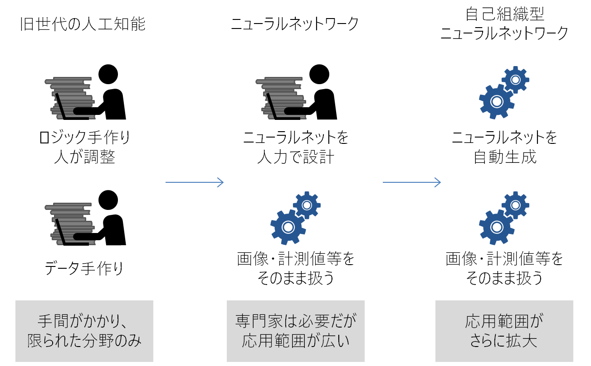
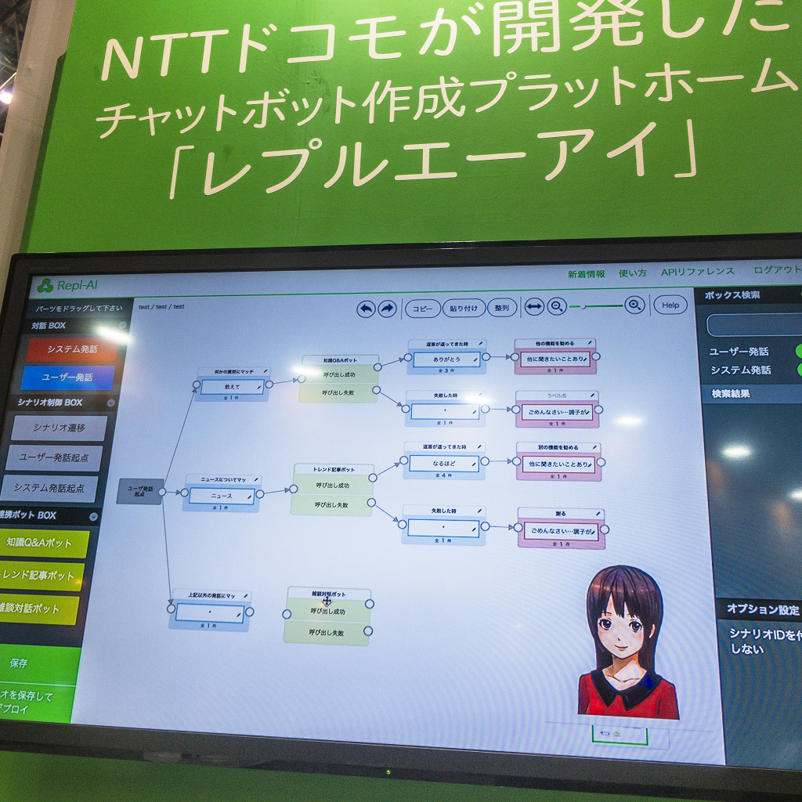
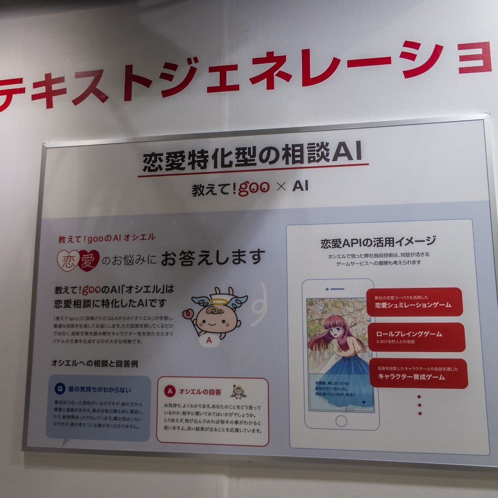
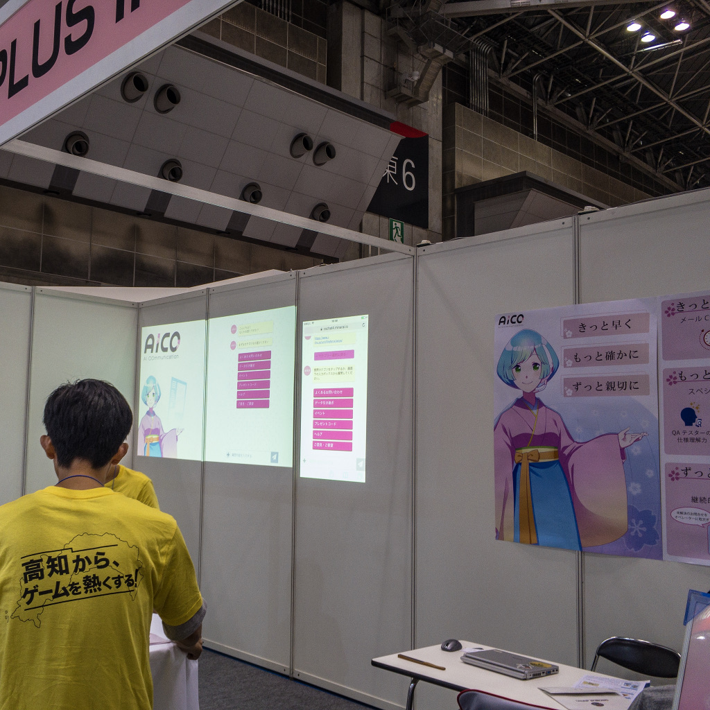
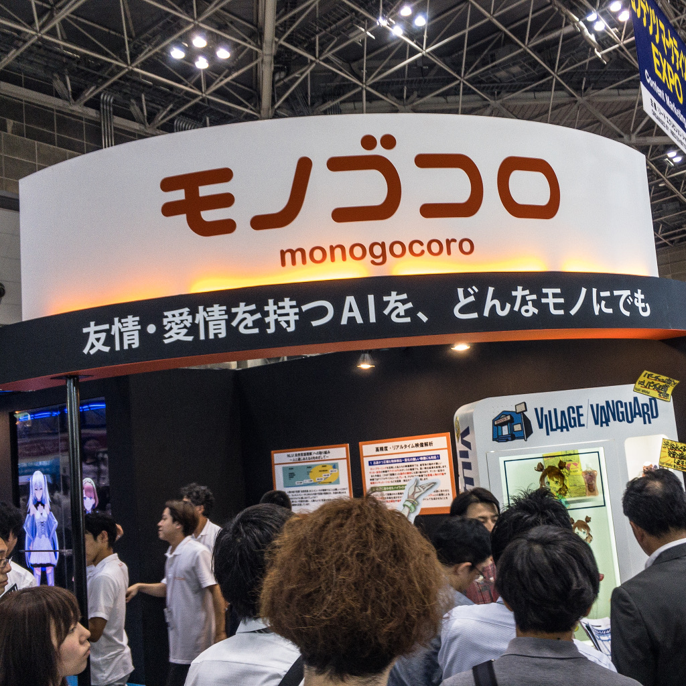
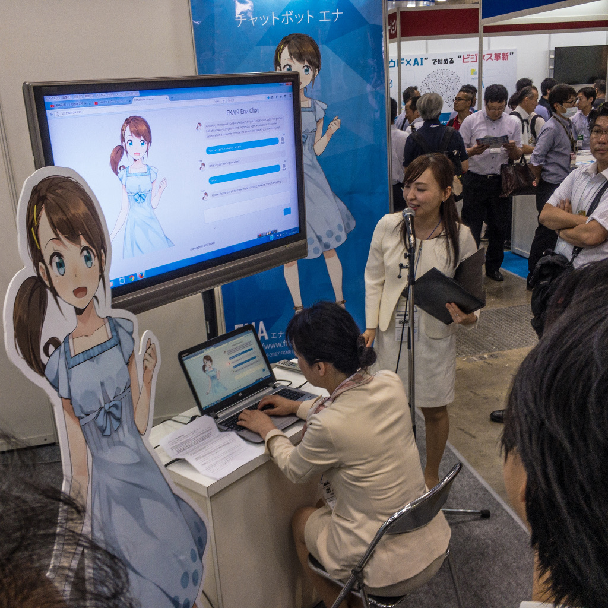
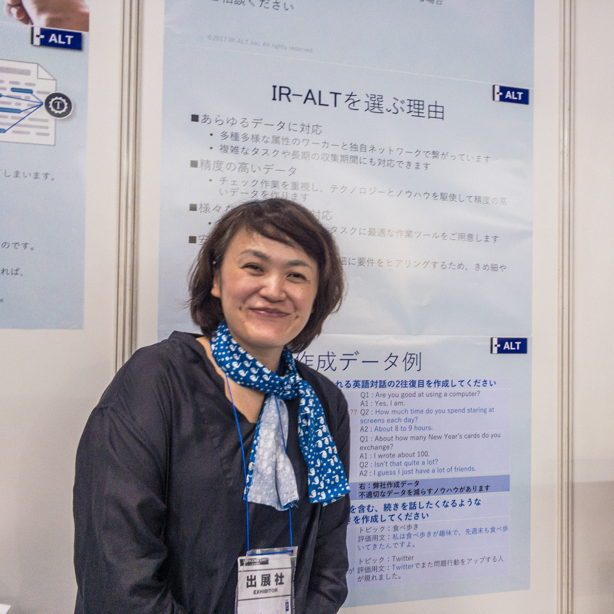

2017年現在、人工知能業界は第３のブームの中にあります。  

AlphaGoが世界トップレベルのプレイヤーに打ち勝ち、実用的な世界でも人工知能が自動運転、がん診断、材料開発、など幅広い分野に急速に応用され始めていることをニュースで見た読者も多いでしょう[^1]。 最も古い世代の人工知能では人間が帰納や演繹といった推論のロジックを設計し、そこに人間が手作りしたデータを与えていました。 つまりロジックもデータも手作りだったため、人工知能は極めて限定的な分野でしか用いられませんでした。 次に現れたニューラルネットワークやサポートベクターマシンは人間がネットワークの構成を設計し、そこに例えば犬の画像、犬でない画像を多数与えて学習させることで初見のデータが犬画像か、 そうでないか判別する能力を持つようになりました。すなわちロジックは人間が作り、データは未加工のまま与えれば学習モデルが自動生成されるようになったわけです。 さらに近年では全結線のニューラルネットワークをそのまま巨大化するのではなく、要所要所に節となる収束した層を設けることで認識能力が飛躍的に向上するというブレイクスルーが発見され、 人工知能技術の応用が急速に広がって、このような方法はディープラーニングと呼ばれるようになりました。 先進的な取り組みの中にはニューラルネットワーク自体の設計を別の機械学習の手法で自動的に最適化させることが可能な手法[^2]もあり、 一部の例では人間がルールを与えることもなく、また人間が手を加えていないデータから、計算資源さえ与えれば人工知能が相当に複雑な判断をこなせるようになりました。  

これらの人工知能技術は、アルゴリズムだけで成り立っているのではありません。 近年のクラウド環境のように巨大な計算資源を安価かつ容易に運用できるようになったこと、人々がネットワーク上に膨大なデータを蓄積し、 またそれを利用しやすくなったことも寄与し、こんにちでは人工知能関連の商用サービスもたくさん出現し始めています。  

今ディープラーニングの技術が得意としているのは数値や画像を扱う分野ですが、テキストの処理においても新しいアルゴリズムが登場しています。 従来は文書中に含まれる各単語の数と希少性だけを用い、語順や意味は考慮しない Bag of Words と呼ばれる手法が知られており、迷惑メールとそうでないメールを判別するのに応用されたり、 webページの検索エンジンに用いられていました。近年では文書やフレーズを構成する単語の並び順を特徴量とした Word2Vec という方法が開発され、より文脈をくみ取った機械学習への期待が高まっています[^3]。  

テキストを扱える人工知能技術の発展と並行して、LINEをはじめとしたチャットベースのユーザーインターフェースがごく自然なものとなっていることも大きな変化です。 上述のような社会、技術の変化により、チャットボットはこれまでと全く違ったイメージで語られるようになりました。 そして2017年、ビジネスとしての人工知能サービスを概観できる[展示会](www.ai-expo.jp)が開催され、そのうちおよそ1/3を占めていたのが自然言語関連であした。 そこで今回は展示会で話を聴くことができたチャットボットについてレビューします。 　

## 総説

今回の展示におけるチャットボットは大きく二種類に分類できます。 一つはユーザーに情報を提供する業務向けチャットボット、もう一つはユーザの感情に訴えるエンターテイメント向けチャットボットです。  

業務向けチャットボットは、企業や自治体のサイトのFAQや人間のオペレータによる電話での問い合わせ業務を一部代行する用途で設置される例が増えています。 webページのFAQは知りたいことにたどり着くまでにあちこち探し回る手間が煩雑だったり、複雑な検索式を考える必要があったりして、ユーザが途中であきらめがちです。 それに比べてチャットベースのインタフェースは単純明快で、自然に使うことができます。また、企業への問い合わせは8割がた同じ質問に集中するといわれており、 定型的な質問を24h稼動のチャットボットでさばくことで人間のオペレータの負担が小さくなるというメリットがあります。  

そんな業務系チャットボットにあっても、ある程度の雑談能力は求められます。ところがストーリー性のある雑談になると一問一答形式のチャットボットは途端に対応が難しくなります。  

一方、エンターテイメント向けチャットボットはユーザに親密さや面白さを感じさせる事に主眼を置いており、より高い雑談能力が求められています。 これら二種類のチャットボットは、かつての人工無脳と比べてどのように進化したのでしょうか。  

## 窓口に立つチャットボット達

### [Repl-AI](https://repl-ai.jp)
* NTT Docomo
* 業務向け
* シナリオ型

ユーザーとのやり取りをすべて書き下したシナリオを使って会話を行うチャットボットのプラットフォームです。  

「雑談が可能」とうたわれているものの、それもシナリオの範囲で行われるためシナリオ製作はかなり負担が大きいようです。 このチャットボットは自治体や企業で運用され、ごみの分別方法を答えたり、製品の使い方を答える用途が想定されています。そのため間違った回答をしないことが要求され、深層学習のように何を学習し、どんな返事をするか目に見える形で決めにくいシステムは不向きです。内部的にはかつてアメリカで多くのチャットボットに利用されたAIMLと呼ばれる言語を使っている模様ですが、シナリオ作製には今風のグラフィカルなインターフェースが用意されています。

### [教えて!goo AI オシエル](https://aixdesign.goo.ne.jp/?utm_source=google&utm_medium=cpc&utm_campaign=aixdesign&gclid=CjwKCAjwkPX0BRBKEiwA7THxiDyw8u-avq0QryZ3PyUYCHfyp3BljmSKK9chlmBktXibPFJmOMFnpBoCguEQAvD_BwE)

* NTTレゾナント
* 業務向け
* 深層学習

恋愛の悩みに一問一答形式で答えることに特化したチャットボットです。教えて!gooのようにユーザが質問や回答を投稿する掲示板にコメントを投下します。大まかな筋書きとして「共感」「当たり障りのない回答」「励まし」の順に返答を並べて生成することで、程よいボリュームでユーザが受け入れやすい回答をするという戦略をとっています。また恋愛相談ではDV被害や不倫など、不適切な回答が人間のユーザに重大な被害を与えかねない内容も多く、オシエルではそういった内容を意図的にスルーするようにしています。回答を生成するため過去のユーザの回答を教師データとしていますが、回答の中で矛盾したものや上述のようなNGジャンルを排除するため、学習前に人間が事前にふるい分けをしているようです。  

回答の生成には質問をベクトル化し、それに対応する返答ベクトルを選び、ベクトルを日本語の回答に文字列化するという手法がとられています。いわゆるディープラーニングを応用した技術ですが、基本的には人間のようには日本語を理解しておらず、表面的な文字列の類似性よりも揺らぎを許容できるベクトルの類似性を使って質問-回答のマッチングをしていると思われます。その意味では精度や揺らぎ許容性の違いはあるものの、本質的には辞書を使った返答の延長線上です。 　

なお、KDDI Evolvaの[AI チャットボット](https://www.k-evolva.com/services/omnichannel/aichat/)、Softbankの[APTWARE](https://rizbell.jp/)なども、 一問一答形式の業務用チャットボットで、よく似た業態の中で、やはりよく似たサービスを展開しています。

### AICO
*SHIFT PLUS
*業務用
*選択肢型

選択肢を選ばせる方式がメインのチャットボットです。各社のチャットボットの日本語でのやり取りは、宣伝しているほどには発達していません。 インタフェースを選択肢型に割り切ることで、会話している雰囲気は少なくなるが、間違いが減るうえに商品の画像などを積極的に使うことができます。 業務用ではそれも一つの戦略です。 

## 雑談をするチャットボットたち

### TAMa-Cプロジェクト

*モノゴコロ
*エンターテイメント系

「友情・愛情を持つAIを、どんなモノにでも」と言い切る展示のモノゴコロ社。どんな相手に対して、どうなったら友情と呼ぶのかきわめて興味深いところです。 公開可能な範囲でと話を聴いてみたところ、仮想アドレナリンや仮想ドーパミンといったホルモンのようなイメージの内部状態を持ち、 それらがどのように変化するのかについては「パズルを解くような処理」を試みつつある、とのことでした。この仮想内分泌系というアイデアはSoftbankのペッパーでも採用されており、いかにももっともらしく聞こえます。しかし心理学の世界ではアドレナリンが出るから攻撃するというメカニズム[^4]と攻撃したいからアドレナリンが出るというメカニズム[^5]のどちらか、または両方が心の中にある[^6]と論じられており、内分泌系だけを持ってきても結局なぜ行動したくなったのかという動機を説明する説得力は今一つと感じます。また、技術を紹介するパネル展示はあった一方で実機のしゃべるキャラクターは店舗に設置するデジタルサイネージでした。店舗における接客では基本的に初対面の相手ばかりであり、お客さんに対してどのように友情・愛情をもち対応を変えるか聞いたところ、サイネージというシチュエーションは友情や愛情を用いるのに向かないため、また別の設計をしているということでした。  

心のメカニズムに関する部分は人工無脳研究者として非常に気になる部分であり、つい根掘り葉掘り聞きたくなってしまいます。インタビューはEXPOの終了時間を少し超えてしまいましたが、最後に本当は心理学や深層意識について論じる必要があるのではないかと質問したところ、 モノゴコロ社CEOはそんな議論の機会を渇望していると語ってくれましいた。

### チャットボットエナ

* 藤崎京都人工知能研究所(FKAIR)
* エンターテイメント系

FKAIRは藤崎電機から最近スピンオフした企業です。藤崎電機といえば太陽光発電システムや噴霧乾燥機のメーカーという印象が強いです。 しかし太陽光発電の運用を効率化するのに人工知能を応用したノウハウなどをもとに、ごく最近人工知能の研究所が子会社化されたようです。 資料には「感情をもつ人型ロボットの研究開発」とあります。どんな感情をもつのか話を聴いてみたところ、現在鋭意研究中とのことでした。 

## チャットボットの周辺技術
### 言語データ作成サービス アイアール・アルト

チャットボットに会話を学習させるためには、膨大なチャットログが必要になります。これはかつての人工無脳と変わるところはありません。 質問サイトの回答やFAQのようなキャラクタ性を必要としないケースでは既存のログをたたき台にすればよいのですが、性格や特定分野の知識をチャットボットに求め始めると会話ログ＝コーパスの創作が必要になります。チャットボットのシステムを考えるエンジニアはアルゴリズムを考えるのが得意ですが、コーパスの創作は小説を書くような作業であって必ずしもエンジニアが得意ではない場合があります。これを専門に行う企業がアイアール・アルトです。コーパスの重要性、製作の負担が次第に認知され、ビジネスとして成立している点は非常に興味深いです。  

ちなみにコーパス製作には人海戦術が使われており、数百人の登録メンバーがお題に沿ったコーパスを作ってそれを集約し、数十万～数百万行といった規模にまとめています。このような方法になるのは、個人ではすぐに会話のパターンが尽きてしまうからです。 

[^1]: 岡野原大輔 “実世界の人工知能　―自動運転、ロボット、ライフサイエンス、アートクリエーション”(2017) [slideshare](https://www.slideshare.net/pfi/lecture-univtokyo-2017okanohara)
[^2]: K. Fukushima, “Neocognitron: A Self-organizing Neural Network Model for a Mechanism of Pattern Recognition Unaffected by Shift in Position”, Biol. Cybernetics 36, 193 202 (1980) [pdf](http://www.cs.princeton.edu/courses/archive/spr08/cos598B/Readings/Fukushima1980.pdf)
[^3]: Hironsan “絵で理解するWord2vecの仕組み”(2015) [Qiita](http://qiita.com/Hironsan/items/11b388575a058dc8a46a)
[^4]: J. A. Russell, "A circumplex model of affect", Journal of Personality and Social Psychology, 39, 1161–1178 (1980).
[^5]: A. Adler, (訳)岸見一郎 "人生の意味の心理学" , アルテ (2010) [amazon](https://www.amazon.co.jp/gp/product/4434145061/ref=as_li_qf_sp_asin_il_tl?ie=UTF8&tag=jinkoumunouha-22&camp=247&creative=1211&linkCode=as2&creativeASIN=4434145061&linkId=c236a127c2a42286cea38f2ff5c2efb5)
[^6]: J.Dispenza, "あなたという習慣を絶つ", NATURAL SPIRIT(2015) [amazon](https://www.amazon.co.jp/gp/product/4864511683/ref=as_li_tl?ie=UTF8&tag=jinkoumunouha-22&camp=247&creative=1211&linkCode=as2&creativeASIN=4864511683&linkId=5223af78bbef45242fcd95bf3a3bf0a2)