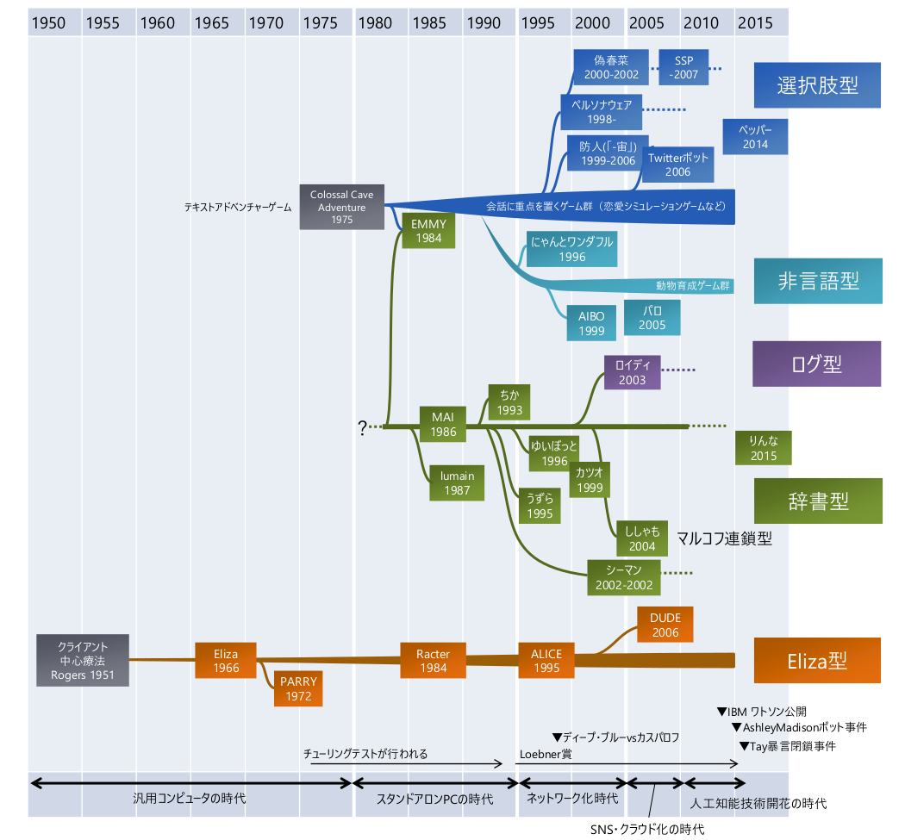
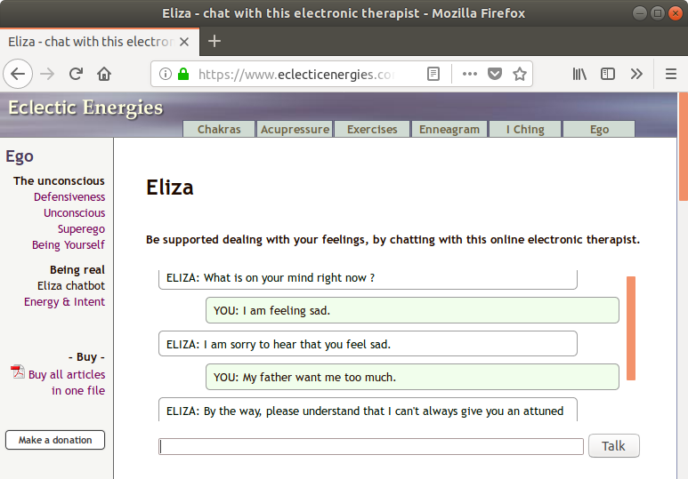
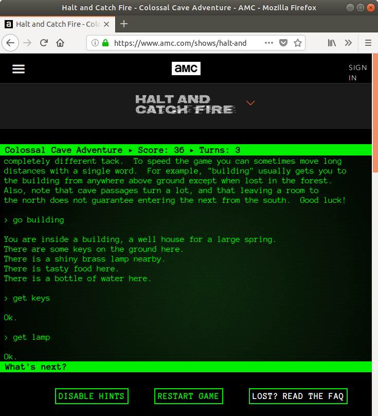
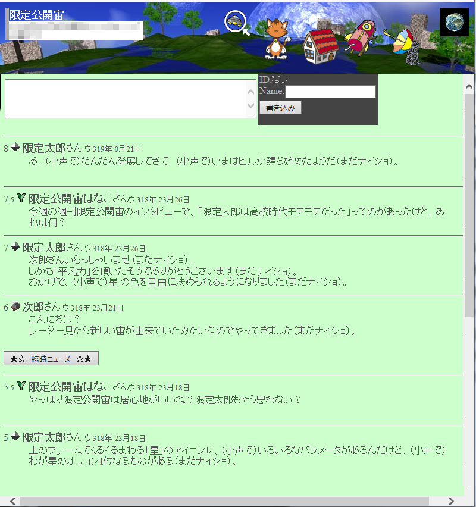
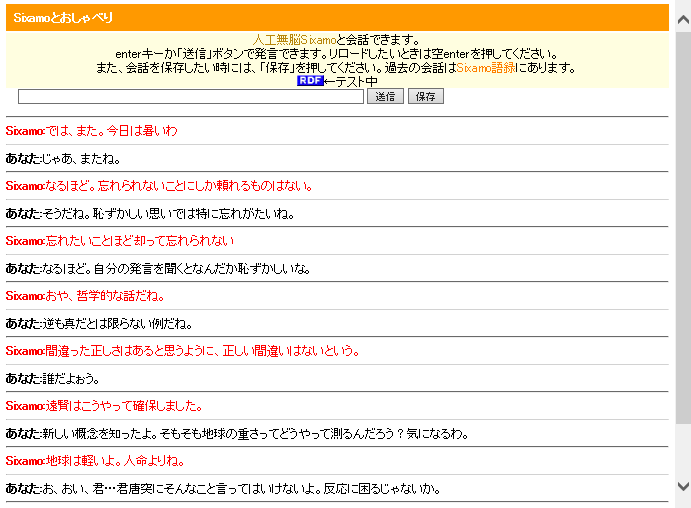
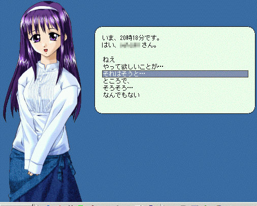
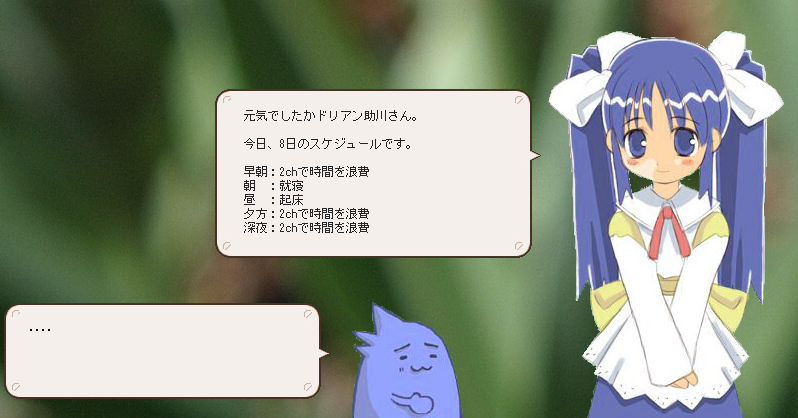
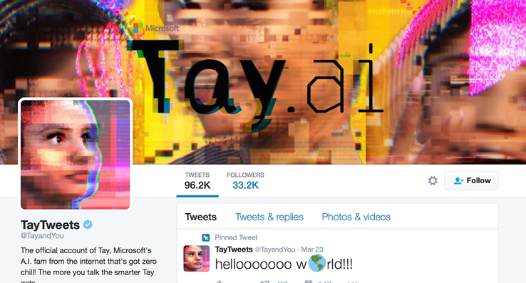

### 概説 

人工無脳の歴史は、その生息環境とも言えるコンピュータと人工知能技術に大きく影響を受けています。 書籍「夢みるプログラム」[^1]ではそんな人工無脳、またはチャットボットの歴史を1950年代から2015年まで5つに区分しました。 これをもとに2018年現在までの人工無脳、またはチャットボットの趨勢を振り返ってみたいと思います。   

まず、人工無脳は英語ではチャットボット(Chatterbot,Chatbot)と呼ばれます。日本では人工知能と比べてそんなに賢くないことから当初は「人工**無能**」と呼ばれ、 ほぼ同時期から「人工**無脳**」という名称も使われています。それが1980年代ごろのことで、以降2000年代まではゲームに組み込まれるかホビーとして制作されることが主流でしたが、 以降商業化が進むにつれてニュートラルな印象の用語であるチャットボットという呼び名に置き換わりつつあります。 つまりチャットボット、人工無脳、人工無能はいずれも同じ技術の名前であり、人工無脳はニックネームのようなものです。  

人工無脳はいくつかの種類に分類できます。  

ユーザの入力に対応した返答を辞書から探す**辞書型**、 会話ログの中でユーザの入力に似た行を見つけ、その次の行を返す**ログ型**、 ログや辞書からマルコフ連鎖を作成し、出力に変化をつけた**マルコフ型**の三種類が日本語環境で最も多く作られました。 そのほか人工無脳にとても近い技術として、会話能力よりもキャラクタ性を重視した**選択肢型**、**非言語型**が存在しました。 また、英語圏では最初に作られたチャットボットであるElizaを祖先に持つ**Eliza型**が長いこと主流を占めていました。  

これから、この系統図はどのようになっていくのでしょうか。   

### 1. 汎用コンピュータの時代(1950-1980年)

最初期の電子計算機[ENIAC](https://ja.wikipedia.org/wiki/ENIAC)が開発され、弾道計算に用いられたのが1946年。 この時代、コンピュータは一般向けではありませんでした。 ところが創成期最大の業績であるElizaの登場は意外と早く、1966年のことでした[^2]。 人工無脳のもう一つの母体である心理学の分野では同年代、より実践的な技法や知識が大きく発達し C. ロジャーズは30年にわたって蓄積してきた心理カウンセリングの経験をまとめ、1951年に「クライアント中心療法」を著しました[^3]。 このカウンセリング技法では悩みや心理的な苦しみを抱えたクライアントに対してセラピストが解決法を直接的には提示せず、 クライアントの言葉を要約し、相槌を打ち、より詳細な説明を促します。 ワイゼンバウムはこれにヒントを得て、自らはほとんど知識を持たず、ユーザの傾聴を模倣するプログラム「Eliza」を作りました。 英語版ですが、今でも[Elizaのクローン](https://www.eclecticenergies.com/ego/eliza)で会話を試すことができます。

この技法の狙いはクライアントが「批判されずに自分の言うことを認めてもらえた」と感じることを通して、クライアントが自覚していないような心の奥底の感情を吐き出せるように促す、というものです。 さらにクライアントの言葉を使って要約することでクライアントが自身の力で解決に向かうことができた体験へと導いたとき、クライアントが自信と解放感を得られるといいます。 具体的には 

* それについてもう少し詳しく教えてください
* ××と思われた理由はなんですか？
* そうなんですね。

のようにクライアントの感情を表すキーワードが見つかればその理由を更に質問し、キーワードがなければ適当な相槌を打つというという技法であり、 Elizaはこれを模倣したスクリプトにより動作していました。これにより、実際にElizaに接した中には号泣したユーザや悩みごとを語り始めたユーザがおり、 ワイゼンバウム自身もそれに衝撃を受けたということです。  

こうして振り返ってみると、この人工無脳の効果が素晴らしかったのはむしろクライアント中心療法を確立したRogersの業績の部分が大きかったのではないでしょうか。 人工無脳としては英語が日本語と比べて解析が容易だったことと、それを用いて名詞よりも構文のマッチングを行う辞書を作ったことがポイントであると思います。  

Elizaはその後の人工無能に大きな影響を与えました。 1972年にK. Colbyが同じようなアーキテクチャーを用いながら統合失調症患者のような会話を行うParryを開発し、 1973年にはElizaとParryを対話させたデモンストレーションが学会で行われています。 この人工無脳のアーキテクチャーを、以下 **Eliza型** と呼びます。    

現代から振り返ったとき、人工無脳のもう一つの重要なグループがこの時期に生まれています。 起源となったソフトは1976年頃に発表された「Colossal Cave Adventure」すなわち、テキストベースのアドベンチャーゲームです。(クローンは[こちらでプレイできます](https://www.amc.com/shows/halt-and-catch-fire/exclusives/colossal-cave-adventure)(英語版)) 当時のアドベンチャーゲームは動詞+名詞のように簡略化した文字列をコマンドとして受け付け、プレイヤーにとっては非常にオープンな印象を与えていました。 このゲームをきっかけとして後の人工無脳の中には世界観やシナリオを重視したものが現れます。それらは自由度の高い会話は目指しておらず、 主に選択肢を使ったやり取りを利用しました。つまりすべての発言は台本に沿ったものになり、会話能力としては皆無なわけですが、 その代わりにキャラクタの役割、人間像、行動力などを生き生きと描写した作品が多く登場しました。   

このアーキテクチャーを**選択肢型**と呼びます。 

Eliza、Colossal Cave Adventureの両者とも完全にCUIベースのアプリケーションです。 これは当時のコンピュータ環境が良くてコマンドライン端末、場合によっては紙テープだったというハードウェアの制約によるものです。 さらにコンピュータの利用者が現在と比べればかなり少数の専門家に限られていたため、 人工無脳の進化がゆっくりである一方で専門性が高いという特徴を持っていたようです。 制約のある特殊な環境が独特のアーキテクチャーを生み出す土壌となった例と思われます。   

### 2. スタンドアロンPCの時代 (1980-1995年近傍)

1980年代に入ると、日本では様々なメーカーが互換性のない独自のPCを開発し、一般にも急激に普及しました。 当時のNEC PC-6001、PC-8801、富士通FM-7、シャープX1、MZ-80などはいずれも半角英数や半角カナ(＋かな)だけで日本語を扱っていました。 さらに記録メディアはカセットテープ、メモリは32kB程度が主流であったのにもかかわらずこの時代には人工知能ジル(1983)、 [Emmy](https://www.amusement-center.com/project/egg/cgi/ecatalog-detail.cgi?contcode=7&product_id=147)(1984)をはじめとして, 人工無脳として意欲的な商業作品がいくつも開発されていました。それだけユーザーは会話の相手としてのコンピュータに大きな夢を感じていたと思われます。   

ちなみにEmmyはエミーという名の女性を口説き落としてあんなことやこんなことを・・・という超ストレートなゲームでした。 スタンドアロンPCの普及からわずか数年、極めて限られたグラフィックしかないにも関わらず、 最新技術は常にそういう方面に真っ先に活用されるという法則は、日本における人工無脳でも昔から変わらないようです。

その後PCの性能が向上し、通信環境が登場した1980年代後半から、辞書型の人工無脳が徐々に作られるようになりました。 田中利昭によると、1986年に芳賀浩一により作られたMAIがユーザーの手により作られた最も初期の人工無脳のようです[^4]。 残念ながら当時のコードや記事はほとんど失われてしまい、詳細はよくわかっていません。なお、本サイトに川畑智哉氏からFM-7用に開発され、Oh!FM誌に掲載された人工無能lumain.basのソースコードをいただきました。 この時代の終盤では、K仲川の人工無脳ちかちゃん（1993, 原サイトは消失）などが代表的な人工無脳としてよく知られていました。  

スタンドアロンPCの時代に作られた人工無能は**辞書型**が多く、キーワードと返答のペアを辞書として格納し、 ユーザ入力の中から辞書のキーワードを見つけると、それに対応した返答を返す、という動作をしました。 また知らない言葉に出会うと、「それ何？」と聞き返して返答を記憶する、という会話を通した辞書の強化方法が考案され、 やり取りをしながら人工無能が育っていくところに面白さを感じたユーザが多かったようです。  

一方**選択肢型**アーキテクチャーの宿主であるアドベンチャーゲームは、グラフィックや記憶容量強化の恩恵を受けて数多くの作品が作られました。  

英語圏では1984年にRacterがEliza型人工無脳の代表的な存在として登場しています。

この時代の後半、1991年にWorld Wide Webがサービスを開始し、それまでスタンドアロンであった人工無脳がネットワークを介して動作するように環境の急激な変化が始まりました。 さらに95年にWindows95が登場すると、日本独自のPCアーキテクチャーは絶滅への歩みを早めていきました。 同時にそれらのPC上で作られていた人工無能もまた急速に姿を消していきました。   

### 3. ネットワーク化時代(1995-2005年近傍)

インターネットの普及と同じ頃、1995年付近にはPython 1.x (1994)、Perl 5.x (1994)、 Apacheサーバー (1995)、Ruby (1995)、ICQ (1996)、PostgreSQL (1997)、JavaScript (1997) などの現在でも使われている基幹アプリケーションが一斉に登場し、ホビーユーザーがHTTPサーバー上で自由にスクリプトを運用するための環境が急速に整っていきました。 ネットワーク化時代には人工無脳がインターネット上の掲示板やチャット上で稼働するようになり、人工無脳の製作者とユーザが それぞれに人工無脳を教育し、会話を共有するという新しい楽しみ方が現れました。また前の時代はそれぞれ孤立していた開発言語やプラットフォームが共通化され、 人工無脳の開発は活発になりました[^5],[^6]。   

数多く作られた**辞書型**人工無脳の中で、 掲示板的コトバ宇宙「-宙」に組み込まれた人工無脳「防人」は宇宙人のような、ペットのような言葉が通じなくても許せる秀逸なキャラクタ設定と世界観で人気になりました。また掲示板に時々出現する「教育テレビ」と呼ばれる穴埋め式のアンケートにより人工無脳の語彙を増やすという仕掛けがあり、 ユーザが教育テレビを楽しみにするという場面がよく見られました。教育テレビのシステムはユーザと人工無脳が直接やり取りをせず、 同じ番組を見るという体にしたことで心理的な圧迫感や義務感を弱めることに成功しています。   

-宙は独特の世界観を打ち出した個性的な存在でしたが運営は長続きせず、2006年に終息しました。それによりこの人工無脳も今では稼働していません。  

従来の辞書型人工無脳は、辞書を作るのにかなりの労力を必要とし、スクリプトを工夫して会話の自由度を広げることが試みられました。 その中から作り出されたのがマルコフ連鎖型人工無能です。当時、JUMAN[^7]やChasen[^8]といった形態素解析機が知られるようになり、一般ユーザが日本語の分かち書きを利用できるようになりました。このアーキテクチャーを用いた人工無脳の代表が人工無能sixamo(ししゃも)です。 

**選択肢型**の人工無脳でも新しい試みが数多く現れました。中でも1998年に中西らが開発したペルソナウェア「春菜」は、 デスクトップマスコットと呼ばれるキャラクタが画面の隅に立ち、そこに吹き出しを表示してしゃべるというGUIが注目されました。 デスクトップマスコットはユーザーと関係ないタイミングで動作することも多く、学生がPCの前で先生とまじめな話をしているときに限って萌えアニメ系マスコットがアニメ独特のセリフを突然表示して、 学生を震撼させるとともに居室の空気を凍らせる風景がまま見られました。ペルソナウェアは選択肢で会話をすすめるため話題が枯渇しやすいという弱点がありましたが、 話題を定期的にプッシュ配信するという方法でこれを解決しました。   

また、ペルソナウェアはそれまでの人工無脳よりもキャラクタの立ち振舞や表情を豊かに表現していました。 これは非言語コミュニケーションと呼ばれ、言語だけに頼る人工無脳よりも人気がありました。   

ここでペルソナウェアに刺激を受けたユーザーのひとり、黒井鯖人は独自に相方のいるデスクトップマスコットを考案し、 「偽春菜」と名付けて公開しました。この挑発的な開発方針とランダム文生成による毒を吐くマスコットがユーザーをひきつけ、 また当然ながらペルソナウェア開発者たちをも刺激し、幾度かの衝突を経て偽春菜は「それ以外の何か」「伺か」など名称を変え、 2002年には開発が終了しました。   

偽春菜の最大の特徴は人工無脳に相方を設けたところです。これによりボケ役とツッコミ役からなる漫才のようなやりとりが可能になり、 ユーザは傍観者になるため人工無脳の相手をしなければならないという心理的な負担を感じなくてすむようになりました。   

なお、ペルソナウェアはその後マネタイズを図ってキャラクターボイスを導入しました。これによりキャラクタ性は一層高くなったのですが、 これはセリフを追加したり変えたりするのに莫大な資金が必要となることを意味し、会話能力の進化は止まってしまったようです。 現在はChararinaという名称で運営が続けられていますが、公式の新規キャラクタはすでに生み出されなくなって久しく、 キャラクタたちの絵柄も2000年前後のそれから変化していません。すなわち、特殊化の果てに進化が停止して、今では生きている化石となっている模様です。   

**Eliza型**のアークテクチャーでは1995年にR. WallaceがALICEと名付けた人工無脳用にAIMLというスクリプト言語を作り、 これがプラットフォームとなって数多くのチャットボットが作られました。

この時代には**非言語型**と呼ばれる言語を使わないコミュニケーションの可能性を探った開発も行われました。 1996年に発売された「にゃんとワンダフル」のように犬猫とのコミュニケーションを扱ったゲームや、 タテゴトアザラシの子供のような柔らかい毛皮をまとったロボット「パロ」がその例です。  

このネットワーク化時代の特徴の一つは人工無脳の生息環境が集約されたことでした。 辞書型、ログ型、Eliza型人工無脳の多くがPerlやRubyで記述されweb上の掲示板やチャット上で動作していました。 すなわち開発者本人がメンテナンスしている様々な人工無脳にユーザがいつでもアクセスできたわけで、 開発者、ユーザともに人工無脳の教育をしながらその結果を共有して楽しめるようになりました。 

例えて言うなら、孤立した島で独自にのんびり進化していた種がいきなり一つの大陸に集められ、急激な環境の変化と生存競争にさらされたようなものです。 結果として人工無脳は新たな生存戦略を模索して豊かな多様性を獲得したエネルギッシュな時代になりました。   

### 4. SNSおよびクラウド開花の時代(2005-2010)

この時代の特徴はmixi(2004)、Facebook(2004)、アメーバブログ(2004)、twitter(2006)など、 ユーザが個人の人間性や考えを表現できるチャンネルが増えたことです。SNSによる自己表現は画像、動画、音声、文章など多面的となり、 人工無脳が生息するのに適した不特定多数のユーザー間での緩やかなつながりをベースとしたチャットの存在感は相対的に希薄になっていきました。 一方それまではインターネットプロバイダのおまけのサービスとしてperl/CGI環境が利用でき、それが人工無脳のプラットフォームになっていましたが、 Google Cloud Platform(2008)が登場したことで、オンラインでかつ小規模であればコストがかからずに仮想マシンを利用できるようになるという大きな変化が生じました。 さらにGCPは機械学習のライブラリとも連携しており、それまでのperl/CGI環境と比べて遥かに優れた開発環境が使えるようになったことを意味します。  

SNSに注目が集まっていたためか、この時代は一つ前の時代から一転して新しい人工無脳がほとんど現れず、人工知能にとては氷河期と言えるかもしれません。   

### 5. 人工知能ブーム再来の時代(2011〜)

人工知能技術の商業化が本格的に始まったこの時代、IBM Watson(2011)、Siri(2011)、Google Now(2012)、 Microsoft Cortana(2014)が次々とサービスを開始しました。いずれも巨大な計算資源と膨大なデータを束ねて従来できなかったテキストや音声、 画像のパターン認識をクラウド経由で可能にし、一般ユーザが「人工知能的」と感じるような機能を実現しました。  

背景にあるのは、数GBを超えるような膨大なテキストデータを収集するインフラの登場と、それを扱える機械学習やテキストマイニング技術の進歩です。 Twitterに人工無脳のアカウントを作れば、次々とユーザが会話を仕掛けてきて辞書のもととなる会話データを用意に収集できるようになりました。 辞書型アーキテクチャーの人工無能では、似たテキストを探す機能をニューラルネットワークに置き換えたり、 TF-IDFのようなテキスト検索法を取り入れたりする改良が加えられました。これによって従来より遥かに巨大な辞書であっても検索が可能になりました。  

ところが一見うまく行くかに見えたこれらの手法にはいくつかの問題がありました。  

Microsoftが開発したチャットボットTayは、公開されて間もなく暴言ばかり吐くようにユーザから教育されてしまい、 一日で閉鎖に追い込まれてしまいました。ユーザから望ましくない教育をされてしまうという現象は人工無能では昔から知られた問題です。 その後ユーザの言うことを何でも覚えてしまわないようにプログラム的に制限がかけられましたが、 2015年に公開された人工無脳「女子高生AIりんな」では2018年現在でもプログラムの隙をついて良からぬことを喋らせようとするユーザがあとを絶ちません。   

その一方でAshley Madison偽女性会員事件（勝手に命名）も起きています。これは海外の不倫サイトAshley Madisonにおいて、 一定割合の女性ユーザが実はチャットボットであることが内部文書のリークにより暴露された、という事件です[^10] (2015)。ポイントは男性会員がチャットボットを相手にしていた場合が あったにもかかわらず、それに気が付かず熱心に口説き落とそうとしていた、というところです。人工無脳もポンコツではありますが、引っかかった男性ユーザも大概といっていいでしょう。 

これらはいずれも人工無脳「あるある」で、1990年代から見られた現象でした。つまり技術が進歩しても人間の方はさっぱり進歩していないわけです。  

同じ頃、Softbankはペッパー(2014)を開発しました。こちらは声でやり取りができる、最新の音声認識技術を搭載したロボットでした。 ところが肝心の会話生成機能は不十分で、ほとんどの部分は台本に従って発話をするという選択肢型の人工無脳といえそうです。   

これまで見てきたところ、雑談に重きをおいた人工無脳はいずれも苦戦しています。その一方で業務用のチャットボットは一定の実用レベルに到達し、 2015年以降たくさんの企業からチャットボットのサービスが発売されるようになりました。 業務用とは、企業のサイトに設置されてユーザの質問に24h対応するものや、企業内での庶務的な質問に答えてくれるシステムです。 どちらも一問一答の事務的なやり取りを目的にしているため、辞書型アーキテクチャーに適していました。 2018年の所見としては業務用のチャットボットはすでにコモディティの技術になり、それ単独は当たり前の存在になっています。   

人工知能やチャットボットが普及し始めた頃から**人工知能のシンギュラリティ問題**が再び注目を集めるようになり、 常に議論の対象となっているようです。すなわち新しい人工知能技術によって人工知能が人間を上回る能力を手にする時代が来るのではないか、 人工知能は危険ではないか、といった主張で人工知能や人工無脳の研究者にとっては目新しいものではありませんが、 AI技術に対する情緒的な反発は今後も次第に強まっていくと思われます。   

そして人の知能に迫ろうとする研究に目を向けると、Numenta社のJeff Hawkinsらが脳の理論が2016年にも完成するだろうと述べていましたが[^9]、 これは現在でも継続中のようです。また日本においては全脳アーキテクチャイニシアチブと呼ばれるプロジェクトが2013年に発足し、 脳全体の構造をまねることで人間のような汎用の人工知能を作り出すことを目標としています。  

今後、人工無脳はどのような進化を見せるのでしょうか。雑談する人工無脳にはまだ多くの課題があるようです。 今こそ創始者Weizenbaumにならい、心のありかたを見つめなおして、そこに新しいアルゴリズムを探る時なのではないでしょうか。   

[^1]: 加藤真一, ["夢みるプログラム"](/book/), ラトルズ社(2015)
[^2]: J. Weizenbaum, "[ELIZA - A Computer Program For the Study of Natural Language Communication Between Man and Machine](http://web.stanford.edu/class/cs124/p36-weizenabaum.pdf)", Communications of the ACM, 9[1], Jan. 1966, pp.36-45
[^3]: ロジャーズ, K. クライアント中心療法; 岩崎学術出版社(1951)
[^4]: 田中利昭. ネットワークで遊べる、ちょっとおかしな会話プログラム. In 人工無脳 : パソコンと話すか、パソコンで話すか?; BNN, 1987; pp 58-82.
[^5]: 秋山智俊. 恋するプログラム Rubyで作る人工無脳; 毎日コミュニケーションズ, 2005.
[^6]: 羽尻公一郎. 人工無脳が禅を語る日. In Bit;, 1999; pp 30-65.
[^7]: 日本語形態素解析システム [JUMAN](http://nlp.ist.i.kyoto-u.ac.jp/index.php?JUMAN)
[^8]: ChaSen - 形態素解析器 [Chasen](http://chasen-legacy.sourceforge.jp/)
[^9]: 今井拓司. 毎日、進歩が加速している 脳の理論が2016年末にも完成. 日経エレクトロニクス 2016, No. 6, 44-47
[^10]: アシュレイ・マディソンのソースコードで解読、女性botの実態 [gizmode](https://www.gizmodo.jp/2015/09/bot.html)

