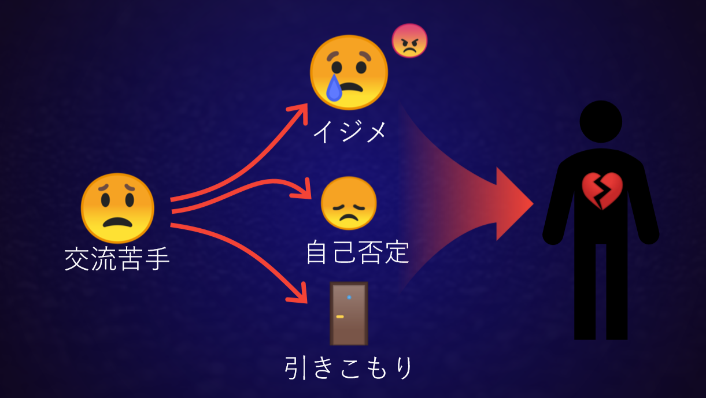
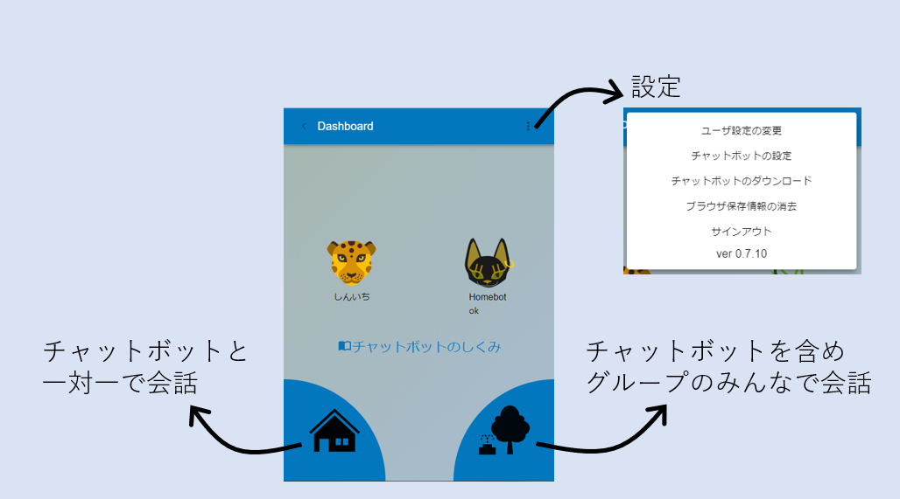
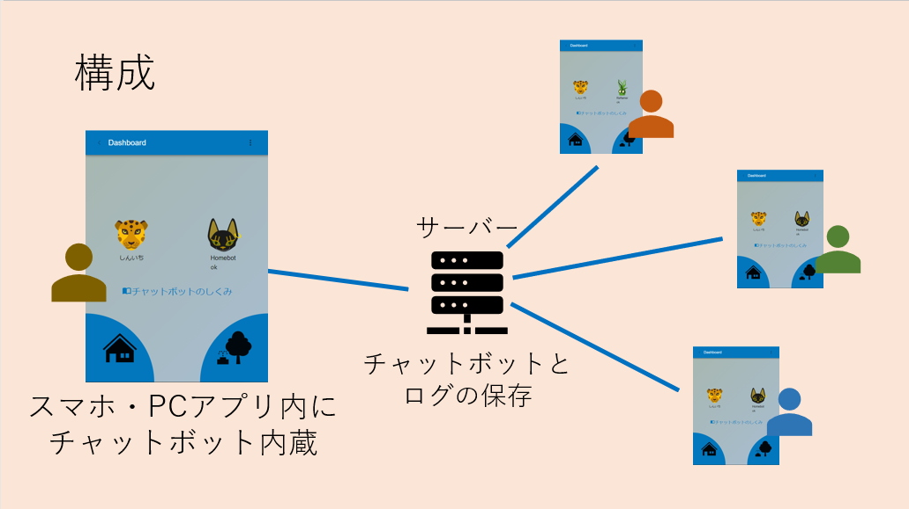

雑談チャットボットの会話力はまだまだ低いのですが、社会的には大きなニーズがあります。もし一人暮らし状態のお年寄りの話し相手をチャットボットがしてくれたら、孤独感をある程度軽減でき、言語能力が維持されて脳にも良い影響があると考えられています。同じ話に何度でも肯定的に付き合ってくれるので精神的にもいいかもしれません。もし人付き合いの苦手な子供たちがチャットボットと会話できたら、いじめに会うことなく交流する練習になるかもしれません。

交流が苦手、というだけでは割とありふれたことのように感じられますが、他の子どもたちと違ったふるまいをする子はいじめの対象になりやすく、その結果自己否定感が強くなったり引きこもりにつながったりする可能性があります。これは大人になってからの人生にも長期に渡ってネガティブな影響を及ぼすことになりえます。  
そこで、「人工無脳は考える」では発達障害を持つ子どもたちの支援を研究している東京学芸大学 藤野博教授、東京学芸大学附属小金井小学校 鈴木秀樹先生、佐藤牧子先生とのコラボレーションにより、**交流が苦手な子どもたちの助けになるチャットボット**の開発をはじめました。  

最初期のチャットボットElizaは、傾聴というカウンセリング技法を会話モデルとしてうまく取り入れ、実際にユーザが悩みを打ち明けたり、心が軽くなったりしたという例がありました。今日でも傾聴の練習をするときには相手の言うことをひたすら聞いて、こちらは **「はい」「そうなんですね」「もう少し詳しく教えてください」** の3つのセリフだけで会話をつなげるということをします。その他にも新しい技法の中に参考になるものがあるかもしれません。

一方で発達障害を持つ子どもたちはゲームのように自発的に楽しいことをしている間は普通の子供と全く変わらない様子で会話ができ、笑い、場に合わせることができます。しかし、宿題のように押しきせられたと感じてしまったものには一切興味を失ないます。その意味ではチャットボットはゲームに近い存在で、愛着を持てるキャラクタやUIの工夫によって楽しく使うことができる可能性がありそうです。  

そして子どもたちに提供されるチャットボットは良い会話ができるように完成されたものである必要は必ずしもなく、子どもたち自身の手によって教育され、会話を豊かにすることだってできるのです。子どもたちは自分が知っていること、自分の意見をチャットボットに覚えさせます。佐藤先生の観察によれば、子供がロボットに教えたセリフを会話の中でロボットのセリフとして聞いたとき、その子どもは自身の言葉を客観的に捉えなおすことができ、成長する機会になった場面がありました。

子どもたちには誰でも大きな可能性を持っています。それが開花する前に社会に馴染めず失われていくのはとても残念なことです。子どもたちがチャットボットとの会話によって会話の苦手を軽減し、普通のお子さんとも友達になれる、そんな未来が来たら最高です。

## チャットボットのエコシステムに求められる条件

ユーザは自分で育てたチャットボットと会話するのもなかなか面白いのですが、第三者から反応があるとさらに面白さは倍増します。つまり孤立した１対１の環境よりも、複数のユーザがいる場にチャットボットも共存していることが望ましいです。その一方で、チャットボット業界では一定割合のユーザが故意に汚い言葉や性的な言葉を使ったり覚えさせようとするという事象が、時代や人種によらず常に観察されてきました。またチャットボットに親近感を覚えた子どもたちは自分のプライバシーに関わる情報をチャットボットに語ったり覚えさせることもありえます。そのため、特に子供向けの場合には大きくても学級単位程度のクローズドなコミュニティの中でチャットボットが運用されるべきです。またチャットボットは子供一人に一つ提供し、自分専用にカスタマイズ・教育できるようにしておくことで、愛着を持ってもらうことができます。そのためには、チャットボットはどのスマートフォンでも、タブレットでも、PCでも動作することが求められます。  

このコミュニティには保護者が介入しないことも重要です。色々言いたくなったり様子を確認したくなる気持ちは理解できますが。  

まとめると要件は以下のようになります。

1. チャットボットはクローズドなコミュニティの中で運用する
1. ユーザ一人ひとりに専用のチャットボットを提供する
1. 子どもたちが扱えるユーザインタフェースを備える
1. どのスマートフォン、タブレット、PCでも動作する
1. 保護者が介入しない

## それを叶える最近の技術

今回の要件に従えば、ブラウザ上で動作するチャットボットが最も運用しやすいでしょう。つまりJavaScriptで動くチャットボットを作るわけですが、最近のスマートフォンではブラウザの計算能力はかなり大きく、JavaScript用の数値計算ライブラリもあるので基本的な機械学習であれば充分に実用に耐えます。またこれを運用するプラットフォームは最近とても充実しており、チャットボット開発者はUIとチャットボット本体に注力してバックエンドの機能はプラットフォームにおまかせにできるようになっています。以下に代表的なサービスをいくつか挙げます。

|サービス名|特徴|コスト|
|---|---|---|
|Google Cloud Platform|サーバー側の自由度が高く、pythonなども実行可能。大規模アプリも構築できる|無料枠あり|
|AWS|サーバー側の自由度が高く、機械学習にも強い|無料枠なし|
|Firebase|サーバーはチャットに適したバックエンドに特化。|無料枠あり|

今回は、この内**Firebase**を利用します。FirebaseにはFirestoreと呼ばれるNoSQLデータベースがあり、リアルタイムでのメッセージの書き込みに適した構成になっています。

## チャットボットシステムの概要

このシステムは一言で言えばチャットボットを内蔵型したグループ型のチャットアプリです。特徴としては自分のチャットボットと1対1で会話するホームモード（家アイコン）と、チャットボットを含めたみんなで会話するハブモード(公園アイコン)があることです。ユーザはチャットボットの辞書を作り、ホームモードで会話してその動きを試すことができます。ハブモードではユーザとチャットボットが一緒にみんなとの会話に加わり、チャットボットが他の誰かと会話するのを見ることができます。

チャットアプリはサーバーに接続されており、ハブモードの会話ログはサーバーに保存されます。また自分で作ったチャットボットはサーバーに保存することができ、スマートフォンとPCで同じチャットボットを使ったり、公開されている誰かのチャットボットをダウンロードできるようにします。

次回はどのようなチャットボットを作るかについて詳しく議論を進めたいと思います。