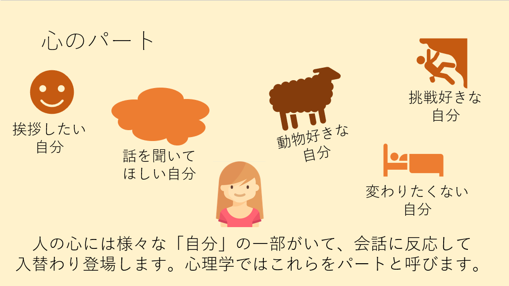
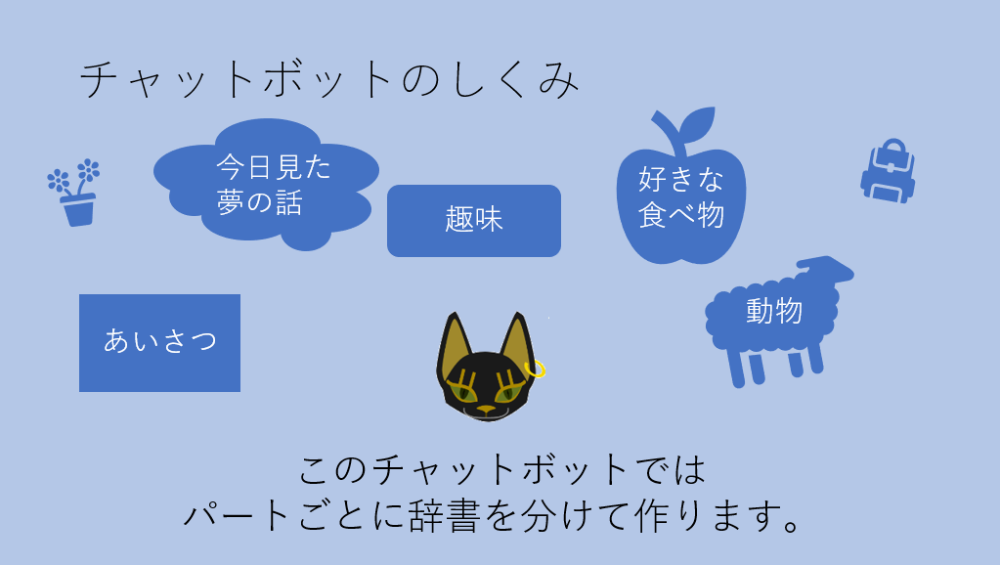
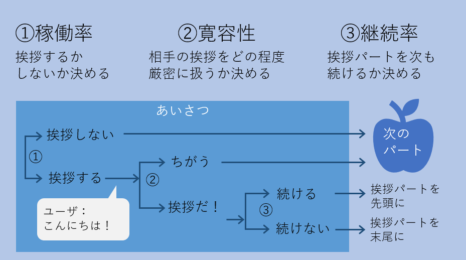
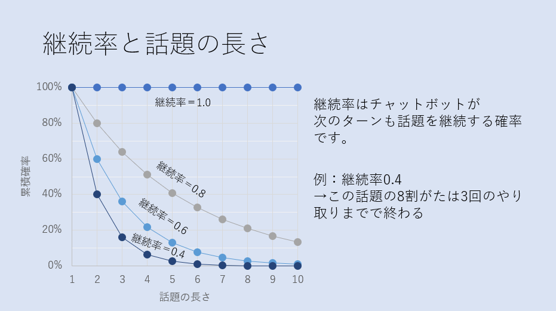

チャットボットの仕組みを簡単に言えば、

1. あらかじめ想定問答集を用意しておく
1. ユーザからなにか言われたら、想定問答集の中で似た質問が書かれた行を見つける
1. その行の回答を返す

という動作の繰り返しになっています。この方法だと、FAQのように一問一答形式のやり取りはできても雑談のようにストーリーのある会話には適しません。ストーリーを重視したチャットボットでは会話ログそのものを再現するような仕組みを使いますが、ユーザとのチャットがこの会話ログと同じストーリーをなぞった場合にだけうまく話が噛み合うことになり、少人数の仲間内チャットのように話題が限定されていなければ会話になりません。そのため、ある程度広い話題に対応しつつ、一問一答形式にならないようなチャットボットを考える必要があります。

ここで、私達の心の中にはそれぞれ別の目的と感情を持った「自分」が心の中にたくさん共存しており、外部からの刺激に反応した「自分」が入れ替わり活性化するというように働いています。

例えば私がお菓子コーナーに立ち寄ったとき、**自分A**がお菓子を我慢しているその瞬間に、別の**自分B**が現れて「つい」お菓子を買ってしまう、という場面があります。この**自分A**は「体重を減らして健康になりたい」という自分にとって良い動機をもっています。一方**自分B**は悪者や怠け者かというとそうではなく、言い分をよく聞いてみれば「ストレスを解消したい」という、自分Aとは異なるものの良い動機を持っているのです。それ以外にも財布を気にする**自分C**や、自分A,B,Cのことを客観的に観察している**自分D**もいるかもしれません。  
この心のパートの考え方に習うと、一つ一つの**自分**はシンプルに設計することができ、**自分**間の相互作用として全体のキャラクタを実装することができるかもしれません。

そこで、先程のより一問一答形式の課題を具体的に考えてみましょう。  

会話は通常、「おはよう」「こんにちは」などの挨拶で始まります。そのためチャットボットでも挨拶は欠かせないのですが、同じ挨拶が会話の途中で行われると不自然になってしまいます。つまり会話の最初は**挨拶**というトピックがアクティブになりますが、それ以降は**天気の話**や**趣味の話題**といった別のトピックがアクティブになればよいのです。トピック＝話題と考えるとわかりやすいですが、パートはそれに限定する必要はなく、様々な目的を持って設計することができます。

各パートは別々の辞書として記述しましょう。それにより一つの辞書は一つの話題や目的に沿った内容に限定することができます。パートは複数あり、アクティブになっているものが入れ替わるという特徴があります。そこでパートをリスト(または配列)に格納しましょう。パートはリストの順番に従って処理されます。
チャットボットの反応が常にリスト通りになってしまうと面白くないので、各パートではまずパートを実行するかどうかを乱数で決めます。これを**稼働率**と呼びます。次に「こんにちは！」というユーザの発言がパートの辞書のどれかに一致するかを検査します。検査の結果、厳密に一致したときだけ反応するか、そこそこでも反応するかを**寛容性**というパラメータで決めます。発言することになったパートはアクティブ状態になり、一度アクティブになったパートはしばらくアクティブな状態を続け、その後休眠状態になるようにします。これを単純なプログラムにするため、次もこのパートを続けるかどうかを乱数で決めます。これを**継続率**と呼びます。パートがアクティブになったらリストの先頭に移動し、パートが休眠状態になったらリストの最後尾に移動させるようにします。

詳細な定義は以下のようになります。

1. **稼働率** は0〜1の実数値で、0だと全く動作しない、1だと常に動作することを表す。乱数がこの値よりも小さい場合は動作する。
1. **寛容性** は0〜1の実数値で、0だとユーザの発言が全く一致しなくても一致したとみなす。1だと厳密に一致した場合のみ一致したとみなす。
1. **継続率** は0〜1の実数値で、0だとパートは全く継続しない。1だと永久に継続する。乱数がこの値よりも小さい場合は継続する。

参考に、いくつかの継続率を例にパートが継続する長さの累積分布を示します。継続率が0.8だった場合、1ターン目に継続される確率は80%、2ターン目も継続される確率は 0.8 × 0.8 = 64%、3ターン目も継続される確率は 0.8  × 0.8  × 0.8 = 51%と減衰していく様子がわかります。

