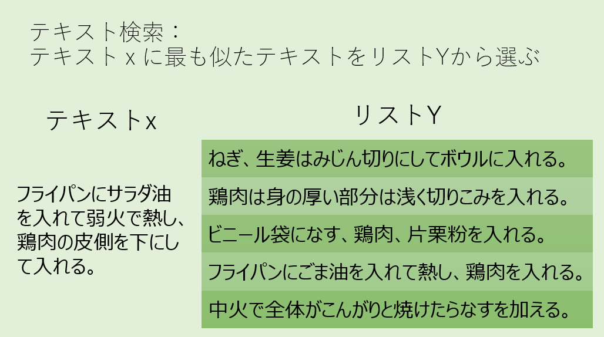

**テキスト検索(Text Retrieval)**は検索エンジンにも使われている、よく知られた機械学習の技術のひとつです。古いチャットボットではこのような方法はは使われていませんでしたが、今日では人工知能の技術がチャットボットにも利用されるようになっています。テキスト検索は***テキストx*** **に最もよく似たテキストを** ***リストY*** **の中から選択する**という問題を解くことと言い換えることができます。また、ここでいう**テキスト**とは自然言語として有効な文字列を示します。



テキストxは自然言語ですから、名詞、動詞、副詞などの並びです。そして「フライパンにごま油を入れて」と「ごま油をフライパンにいれて」が同じ意味になるように、文節単位で見ればある程度順番が変わっても意味が変わらないという特徴があります。そこで、単純化のために単語の現れる順番は無視して、
```txt
「テキストxとテキストyが似ている」ということは「xとyに共通して含まれる単語が多い」
```
と考えることにしましょう。
さてここで、テキストが似ているかどうかを比べるには単語ごとに分解する必要があることになりました。英語などアルファベットを使う言語では単語と単語がスペースで区切られておりなんの苦労もないのですが、日本語はスペース区切りになっておらず単語の区切り方は単純には決められません。これを行うのが**形態素解析**と呼ばれる技術です。日本語の形態素解析器としてはChasenやMeCabが知られています。MeCabの出力結果を見てみましょう。

```txt
ねぎ、生姜はみじん切りにしてボウルに入れる。

↓

書字形  発音形  語彙素読み	語彙素	品詞	活用型	活用形	語形	書字形基本形	語種
ねぎ    ネギ    ネギ 	葱 	名詞-普通名詞-一般 			ネギ 	ねぎ 	和
、 		、  補助記号-読点 				、 	記号
生姜    ショーガ    ショウガ 	生姜 	名詞-普通名詞-一般 			ショーガ 	生姜 	漢
は  	ワ ハ   は 	助詞-係助詞 			ワ 	は 	和
みじん  ミジン  ミジン 	微塵 	名詞-普通名詞-一般 			ミジン 	みじん 	漢
切り    キリ    キリ 	切り 	接尾辞-名詞的-一般 			キリ 	切り 	和
に  	ニ  ニ 	に 	助詞-格助詞 			ニ 	に 	和
し  	シ  スル 	為る 	動詞-非自立可能 	サ行変格 	連用形-一般 	シ 	する 	和
て  	テ  テ 	て 	助詞-接続助詞 			テ 	て 	和
ボウル  ボール 	ボウル 	ボウル-bowl 	名詞-普通名詞-一般 			ボール 	ボウル 	外
に  	ニ 	ニ 	に 	助詞-格助詞 			ニ 	に 	和
入れる  イレル 	イレル 	入れる 	動詞-一般 	下一段-ラ行 	終止形-一般 	イレル 	入れる 	和
。  		。 	補助記号-句点 				。 	記号
```

MeCabでは日本語を単語に区切るために品詞を推定しており、その情報も出力されてきます。今回はこのなかで行頭に表示された「書字形」だけを利用します。