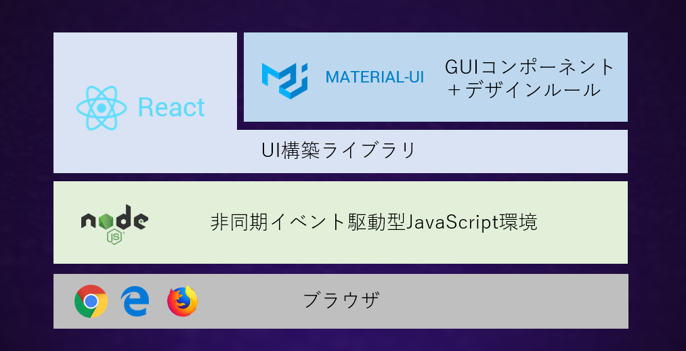
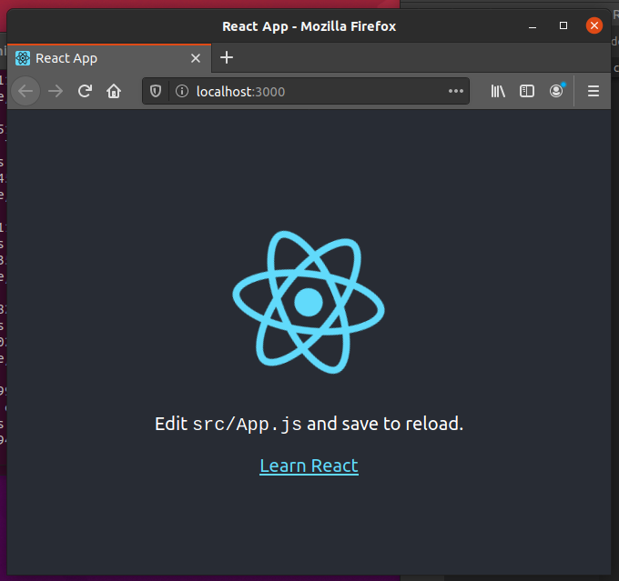

[交流が苦手な子どもたちの助けになるチャットボット](../child-helper-bot)で述べたように、ブラウザ上で動作するチャットボットアプリをJavaScriptで作っていきますJavaScript用のライブラリには素晴らしい機能を持ったものが数多く存在し、なかでもFacebook社の開発したユーザインタフェースを構築するためのライブラリ**React**はUIのコンポーネントをわかりやすく構造化できる優れたツールです。利用者も多く、わからないことはインターネットを探せばほとんどは誰かが答えているのを見つけられます。さらにボタンやダイアログのようなGUIの部品のライブラリも多数あり、その中でGoogleの開発した**Material-UI**はMaterialデザインと呼ばれるデザインルールに沿って設計されており、理解しやすく操作しやすいGUIを作りやすい優れたライブラリです。ReactとMaterial-UIを使うには**Node.js**が必要になります。これらライブラリの関係は次のようになっています。



今回はPC上でこの３つを使ったアプリを製作するための準備の手順を説明します。

## 必要なもの

### Linux環境

windows PCユーザであれば、[VirtualBox](https://www.virtualbox.org/)上に[Ubuntu](https://ubuntu.com/)([日本語対応](https://www.ubuntulinux.jp/ubuntu))環境を用意するのが、最も扱いやすくておすすめです。

### おすすめエディタ

vscodeをオススメします。Ubuntuでは`Ubuntu Software`アイコンをクリックし、vscodeで検索してください。

## インストール

### node.js

node.jsは以下の手順でインストールします。詳細は[こちら](https://qiita.com/seibe/items/36cef7df85fe2cefa3ea)をご覧ください。まず`apt`でnodejsをインストールしますが、`n`と呼ばれるアプリでバージョンの異なるnodejsをスイッチしながら使えるようにします。`n`でインストールされたnodejsと`apt`でインストールしたnodejsが共存しているとどちらを使っているのか混乱するので、`apt`でインストールした方のnodejsを最後に削除しています。

```shell-session
$ sudo apt install -y nodejs npm
$ sudo npm install n -g
$ sudo n stable
$ sudo apt purge -y nodejs npm
$ exec $SHELL -l
```

### React

[新しいReactアプリを作る](https://ja.reactjs.org/docs/create-a-new-react-app.html)に従って以下の手順を実行します。`my-app`はこれから作成するプロジェクトのフォルダ名で、自由に決めて構いません。react-create-appはテストや様々な最適化の方法を予め組み込んでくれます。それらを手動で準備するのは膨大な手間がかかってしまいます。

```shell-session
$ sudo npm install -g create-react-app
$ npx create-react-app my-app
$ cd my-app
$ npm start
```

`npm start`を実行すると、ブラウザが開いてアプリの画面が表示されます。



### Material-UI

上述の`my-app`ディレクトリで、以下のコマンドを実行してください。

```shell-session
$ npm install @material-ui/core
$ npm install @material-ui/icons
```

## テスト

これでReactとMaterial-UIを使ったアプリを開発する準備ができました。
src/app.jsを見ると、以下のような内容になっています。`npm start`で表示された画面と対応しているのがわかります。

```jsx
import React from 'react';
import logo from './logo.svg';
import './App.css';

function App() {
  return (
    <div className="App">
      <header className="App-header">
        
        <p>
          Edit <code>src/App.js</code> and save to reload.
        </p>
        <a
          className="App-link"
          href="https://reactjs.org"
          target="_blank"
          rel="noopener noreferrer"
        >
          Learn React
        </a>
      </header>
    </div>
  );
}

export default App;
```

このソースを一部書き換え、material-uiのコンポーネントを組み込んでみましょう。

```jsx
import React from 'react';
import Button from '@material-ui/core/Button'; 
import CreateIcon from '@material-ui/icons/Create'; 

import './App.css';

function App() {
  return (
    <div className="App">
        <Button
        variant="contained"
        color="primary"
        startIcon={<CreateIcon />}
      >
        Create Your App
      </Button>
    </div>
  );
}

export default App;
```
`npm run start`とすることでブラウザが開き、ボタンがひとつだけ表示されたらインストールは正常にできています。