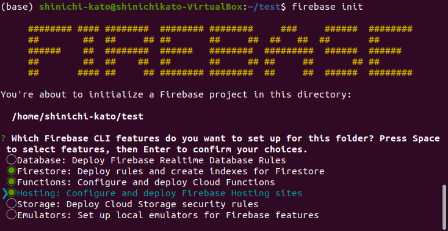
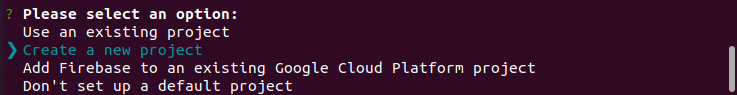
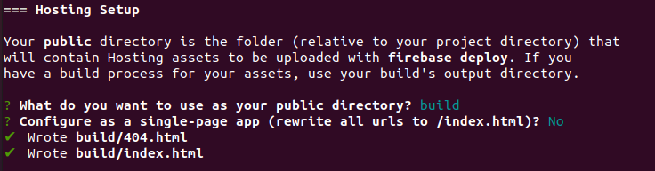
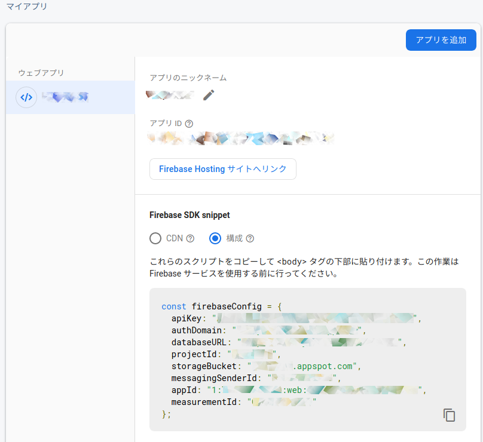
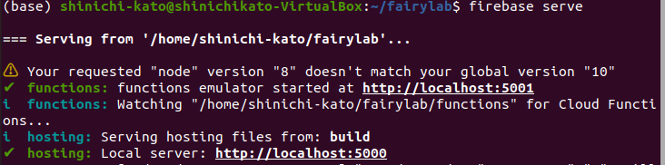

人工無脳は考えるでは、[交流が苦手な子どもたちの助けになるチャットボット](../child-helper-bot/)の回で企画を説明したチャットボットを開発しました。今回はそのインストール方法を説明します。

## 必要なもの（ローカル環境）

### node.js

#### windows10

[node.js](https://nodejs.org/ja/)のサイトからwindows用の推奨版をダウンロードし、インストールしてください。途中で**Chocolatey**をインストールするかどうか聞かれますので、Yesと答えてください。


#### Ubuntu

UbuntuはLinux系OSです。windows10マシンであれば、[VirtualBox](https://www.virtualbox.org/)上に[Ubuntu](https://ubuntu.com/)([日本語対応](https://www.ubuntulinux.jp/ubuntu))環境を作ることができます。node.jsは以下の手順でインストールします。詳細は[こちら](https://qiita.com/seibe/items/36cef7df85fe2cefa3ea)をご覧ください。まず`apt`でnodejsをインストールしますが、`n`と呼ばれるアプリでバージョンの異なるnodejsをスイッチしながら使えるようにします。`n`でインストールされたnodejsと`apt`でインストールしたnodejsが共存しているとどちらを使っているのか混乱するので、`apt`でインストールした方のnodejsを最後に削除しています。

```shell-session
$ sudo apt install -y nodejs npm
$ sudo npm install n -g
$ sudo n stable
$ sudo apt purge -y nodejs npm
$ exec $SHELL -l
```

### git

#### windows10
[Git for Windows](https://gitforwindows.org/)のサイトからgitをダウンロードし、インストールしてください。

#### Ubuntu

```shell-session
$ sudo apt-get update
$ sudo apt-get install git
```


### Firebase
Firebaseのアカウントをまだ取得していなければ、[Firebase](https://firebase.google.com/)にて、アカウント作成をしてください。料金プランは**Spark(無料)**で問題ありません。アカウントが作成できたら以下のコマンドでログインします。

```shell-session
$ npm install -g firebase-tools
$ firebase login

```


### エディタ
vscodeをオススメします。Windows10、Ubuntuともに
[Visual Studio Code](https://code.visualstudio.com/)から最新版をダウンロードし、インストールしてください。
Ubuntuでは`Ubuntu Software`アイコンをクリックし、vscodeで検索する方法もあります。


## ローカル環境へのインストール

### 1.ダウンロード

以下のコマンドでチャットボットのコードをダウンロードしてください。

```shell-session
$ git clone https://github.com/shinichi-kato/fairylab-0.7.git
```

コードをダウンロードしたディレクトリに移動し、必要なライブラリをインストールします。

```shell-session
$ cd fairylab-0.7
$ npm install
```


### 2. firebaseのセットアップ
firebaseのプロジェクトを設定します。以下のコマンドを実行してください。

```shell-session
$ firebase init
```
以下のように表示されるので、カーソルキーの上下でカーソルを動かし、スペースキーでFirestore,Functions,Hostingにチェックを入れてください。Enterで決定です。



次の画面ではProject Setupを行います。Create a new projectを選択してください。



以降いくつか質問が続きますが、基本的には今の設定を変更しない選択をしてください。次にHosting Setupの中で**public directory**の設定を聞かれます。これは**build**にしてください。また/index.htmlを書き換えるかには**No**を選択してください。



次にfirebaseのサイトで今回作成したプロジェクトのページを開き、**プロジェクトの概要**横の歯車アイコンをクリックして**プロジェクトを設定**を選択してください。右側のフレームを下にスクロールすると、マイアプリという欄があります。その中にFirebase SDK snippetがありますので、構成を選んでコピーしてください。なお、この内容は第三者に公開しないようにしてください。誤ってgitに公開してもいけません。



src/直下にcredentialsというディレクトリを作成してください。src/credentials/firebase-init.jsという名前のファイルを作成し、先ほどコピーした内容をペーストして先頭に`export`を加えて保存します。

```js
export const firebaseConfig = {
  apiKey: "(ここにAPI KEYが入る)",
  authDomain: "(プロジェクト名).firebaseapp.com",
  databaseURL: "https://プロジェクト名.firebaseio.com",
  projectId: "プロジェクト名",
  storageBucket: "プロジェクト名.appspot.com",
  messagingSenderId: "000000000000",
  appId: "1:000000000000:web:0000000000000000000000",
  measurementId: "A-0000000000"
};
```

### 3.ビルド

次に以下のコマンドで最適化されたJavaScriptの生成と実行の準備を行います。

```shell-session
$ npm run build
```


### 4. テスト
以下のコマンドで、ローカルのブラウザ上でのテストができます。なお、認証、データベースへのアクセスなどはローカルでのエミュレーションではなく実際のfirebaseを使用しています。

```shell-session

$ firebase serve
```

下記のように`✔  hosting: Local server: http://localhost:5000`が表示されていればOKです。このブラウザでこのアドレスを開くと、アプリが動作するのがわかります。




### 3. デプロイ

テストで問題がなければ以下のコマンドを実行してください。

```shell-session
$ firebase deploy
```

これでfirebaseサーバー上でチャットボットのアプリがアップロードされ、ブラウザから利用可能になります。


