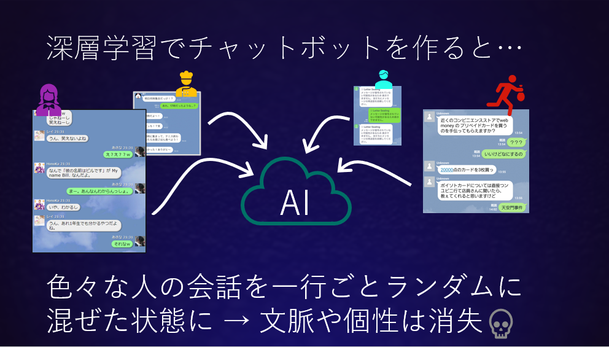

## 人工知能技術にはまだ雑談を扱える能力はない

商業化されたチャットボットの中には大量の情報を集めで自分で学習するとか、感情を理解すると謳っているものが数多く存在します。それらのサイト見ると深層学習、CNN、RNNなどの最先端技術が使われているとするものがあります。一方で**人工無脳は考える**で開発している雑談チャットボットは基本的には人間が辞書を用意する必要がある点で従来の人工無脳と同様です。最先端技術を使わないでいて、高度なチャットボットは実現できるのか？という疑問を感じる方もいるかもしれません。しかし、彼らの言う人工知能技術の内容をよく検討してみると雑談の質を上げるには全く役に立たなかったり、主張するほどの内容を伴っていないのです。

### 深層学習を使わないの？

深層学習はニューラルネットワークの一種で他にもRNN(Recurrent Neural Network)、CNN(Convolution Neural Network)などがよく知られていますが、いずれも機械学習技術の一つです。そして機械学習は回帰または分類をする計算手法です。回帰とはデータにフィットする線を引くことで、Excelでも使える最小二乗法はその最も単純な例です。分類とは、○×など種類の異なるラベルがついたデータの境界線を引くことです。これらは機械学習の中で教師あり学習と呼ばれ、少なくとも数千件以上、できれば数十万件以上の教師データが必要と言われています。


この機械学習で、より複雑な問題をより正しく回帰または分類できるように改良されたのが深層学習で、画像や動画なら良い精度で分類ができるようになってきています。これをテキストについてうまく応用した一つの例が**ニューラル機械翻訳**(NMT)で、[みらい翻訳](https://miraitranslate.com/trial/)や[DeepL](https://www.deepl.com/ja/translator)などでその様子を試すことができます。従来の翻訳ソフトはおかしな直訳が混ざったりして不自然なものでしたが、深層学習を使うことで元の文を一旦ニューラルネットワーク上で内部表現に置き換え、その内部表現を相手の言語の文に再変換するという技術が開発されました。これにより翻訳の品質は人間に匹敵するようになった[^1]と言われています。  

一見すると、この仕組みはチャットボットでも使えそうです。機械翻訳は**日本語→英語**ですが、これを**ユーザ入力→チャットボット回答**に置き換えればいいのではないでしょうか？しかしこの方法ではうまく行きません。機械翻訳の場合は「この日本語はこの英語になれば合格」という正解がかなりはっきり決められます。また人間のプロフェッショナルによって作られた品質の高い英訳を教師データとして使うことができます（実際には品質の高い英訳を大量に集める事自体膨大な労力が要求されるのですが）。一方で雑談の場合はどこから教師データを集めるかという問題があります。少なくとも数千行、できれば数十万行といった規模のデータが必要になるわけですから人間が想定問答集を作るというアプローチは現実的でなく、Twitterのような既存のなにかから会話になっているデータを収集することがよく行われます。その際には不特定多数のユーザから、様々な日付のデータを集めて来ることになります。



その結果、チャットボットの返答は様々な職業、年齢、性別の人が、様々なシチュエーション、時間、相手に向けての発言が一行ごとにランダムに混ざったようなものにならざるを得ません。つまり文脈性が消失するのです。ところが雑談ではこの文脈が非常に重要です。これを解決しようと教師データを分割して状況に合わせた回答をさせようとする研究もありますが、本質的には同じ雑談は二度と生じないので、成果はあまり期待できないでしょう。ここでいう「二度と起きない」とは、歴史的視点を含めて考えると理解しやすく、AさんとBさんが昨日雑談をして今日再会した場合、「昨日雑談をした」ことを踏まえて今日の雑談が始まるので、昨日と全く同じ雑談にはならないということです。ヘラクレイトスが「同じ河に二度入ることはできない」と表現した概念と同じです。  

意味論的な文脈性は上述のように重要なのですが、さらに統語論的な面でも文脈は重要です。特に日本語において、雑談においてはことさら、両者の間で共通の認識となっている語は可能な限り省略されます。任意のユーザが任意のタイミングで行った発話にはそうして省かれた単語がたくさんあるため、文脈の中にない限り意味のあるセリフにはならないのです。  

そして、雑談で最も重要なのは意図です。雑談の中で交わされる情報そのものにはたいして価値がない場合も多く、実は交流分析で言うところのプラスのストロークを交換するという点が雑談の中核です。簡単に言えば「お話して楽しかった」と両者が感じることが目的で雑談は行われるのです。ひるがえって不特定多数の人間のチャットをランダムに集めたチャットボットは...


図のように雑談がつながらず、一問一答状態になってしまいます。それに対してユーザが努力して文脈を読み取ろうとしている様子も見られます。人間同士の会話でこのような状況になったら、こちらの意図とは無関係に「おまえの言うことを真面目に聞く気はない」というメッセージを暗黙のうちに相手が受け取ってしまうことになるでしょう。そして、それはマイナスのストロークにほかなりません。


### 感情の理解を利用しないの？

感情が理解できればチャットボットは良くなりそうに思えますが、具体的に考えると問題が見えてきます。自然言語処理の世界でいう「感情の理解」とは、あるテキストがポジティブかネガティブか、どちらのムードにあるのかを検出しようとする一種の**分類問題**です。分類なので、機械学習を使おうという発想が出てくるわけです。

この分類器は一つのセリフだけを見てそれがネガティブかポジティブかを判定しますが、実際に正しく判定を行うには文脈の理解が欠かせません。ここで文脈と呼んでいる概念は広く、発言者、相手両者の立場や関係、性別まで含める必要があります。例えば同じ笑いの表現があったとして、映画の中でヒーローが笑うこと、悪役が笑うことは同じに扱ってよいのでしょうか？また敵対中と和解後で同じに扱ってよいのでしょうか？そこまで極端でなくても会話の中で利害が一致しない場面に出会うこともあるでしょう。また、内心ネガティブであっても表面上はニュートラルに振る舞うということは社会の中で一般的に行われることです。

```shell-session
客: 緑茶をいれたらホコリみたいなのが浮いてきたんだけど！  

茶屋: おきゃくさん、でもそれは毛茸（もうじ）といって新鮮な証拠なんですが

客: とにかく気持ち悪いから返品するわ！
```

このやり取りは一見噛み合っていないように見えますが、感情面に注目すると次のように解釈できます。まずお客はお金を出して買ったお茶に異常を感じたので、ネガティブな感情をストレートに茶屋にぶつけています。茶屋はお客のクレームに対して内心不当だと感じてネガティブな気持ちをもっていますが、字面のうえでは丁寧に返答しています。しかしそれを聞いたお客は自分のネガティブな感情を理解してもらえなかったので、その「わかってもらえなかった」の分を上乗せして更にネガティブな返答をしています。それが「気持ち悪いから」という表現に現れています。つまりこの３つの発話は客と茶屋という関係性の中で全てネガティブに帰属され、しかもネガティブさが時間とともに強くなると言えるわけです。しかし字面でそれを判別できるでしょうか？このように、**感情の理解**という技術の第一の問題は雑談テキストの表面からではポジティブ・ネガティブを判定することはほとんど不可能、ということです。

もう一つの問題はポジティブ・ネガティブがわかったとしてそれをどのように利用するかという作戦がチャットボット側に欠けていることです。ポジティブな相手にはポジティブな反応を返す、ネガティブな相手にはネガティブな反応を返すというような画一的な方法ではうまく行きません。映画の中でヒーローが笑ったら、観客は一緒に笑えばいいかもしれません。では悪役が笑ったときに観客が一緒に笑ったらどうでしょうか？常にポジティブでは客の相手をする業務用チャットボットのようになってしまうかもしれません。常にネガティブでは罵倒ロボットになってしまうかもしれません。


## チャットボットは何を目指すのか？

さて、以上を踏まえるとチャットボットでは従来のような手作りの辞書を使うことが適切なようです。その上で従来の雑談チャットボットの課題を解決し、より楽しい雑談ができるチャットボットを作るには何が必要なのでしょうか。重要なのは明確な意図を持って辞書をデザインする必要がある、ということです。例えばElizaは**ユーザの話を傾聴することにより、感情の開放につなげる**という一点に集中し成功しました。一方でElizaは傾聴以外の行動をせず、雑談というよりは一種の業務的チャットボットと言えます。実際の雑談では時には相手の言うことを聞き、ときには自分の考えを語り、共感したり笑い話を挟んだりするでしょう。  
しかしすべての行動を従来どおり辞書にすると、上述したTwitter上の不特定多数のユーザによる会話を集めたチャットボットの思考実験のように、ユーザのことを聞かないだけのチャットボットになってしまいます。そこで、今回のチャットボットでは心のパート理論を参考にした、**複数のチャットボットが共存・競争しながら一つのキャラクタとして振る舞う**システムを開発しました。人工知能の[マイクロワールド](../micro-world/)の考え方を、環境ではなく精神の内面に応用したもの、と言えるかもしれません。このチャットボットではパートごとに異なる設計に基づく雑談が行われ、パートが適宜入れ替わるという動作をします。それによって辞書ごとに出来栄えの確認や調整をしながらチャットボットの開発が可能になります。そこで、次回からは以下のようなパートを考えてみたいと思います。

### (a)挨拶するパート

時間や時候に応じた挨拶、雑談しに来てくれたユーザをねぎらう言葉、ユーザの興味を惹きつけるようなきっかけを提供します。

### (b)傾聴するパート

カウセリング技法の傾聴では、来談者の発言を促し、発言の言葉を使って内容を要約・整理して返し、来談者に共感する（同調ではない）ということを基本にします。そのため、感情表現、例えば楽しいとか辛いとか、疲れたとかには積極的に反応して共感を示すことが望まれます。発言を促すには相槌を利用します。内容の整理はなかなか難しいですが、わからない部分をより詳しく聞き直すなどは使えるかもしれません。

### (c)リフレーミングするパート

カウンセリング技法のリフレーミングとは、物事の意味や解釈を別の視点から捉え直してポジティブに言い換えることです。

```
A: 私ははっきり相手に言い返せない性格なんだ・・・

B: 相手の気持を大切にされる方なんですね。

```
このような言い換えによって、相手の気持をポジティブに変化させることを狙います。

### (d)くすぐりパート

ちょっとした笑いを生じさせるような会話が雑談の中では重要です。人間は意外なことに出会うと笑いが出てきます。ランダム文生成などを使うことで通常では考えつかないような5W1Hを生み出し、笑いにつなげます。荒唐無稽になるのは大いに推奨されますので、荒唐無稽であることが許容される場面設定を考えることがポイントになります。


[^1]: [機械翻訳の原理と研究動向](https://www.google.com/url?sa=t&rct=j&q=&esrc=s&source=web&cd=5&ved=2ahUKEwiG9cP_janpAhXB7WEKHbxuC6YQFjAEegQIBRAB&url=https%3A%2F%2Fdokkyo.repo.nii.ac.jp%2F%3Faction%3Drepository_action_common_download%26item_id%3D1873%26item_no%3D1%26attribute_id%3D22%26file_no%3D1&usg=AOvVaw0xr-v4YGEp3mKpIzlNiCQj)