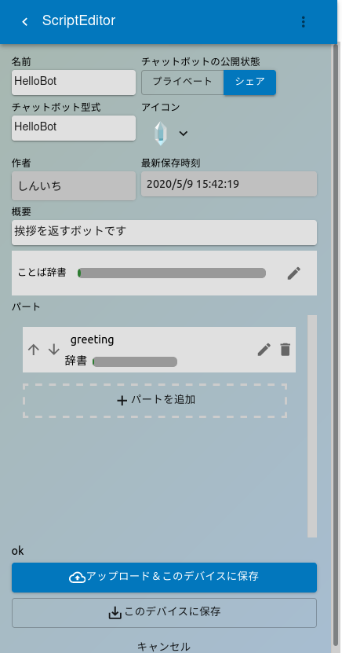
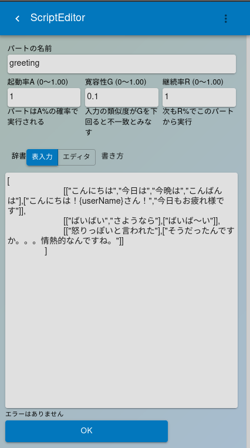

このチャットボットはパートごとに辞書を作成します。まずはじめに、挨拶をするパートを作ってみましょう。アプリ右上のメニューから**チャットボットのダウンロード**を選んでください。**HelloBot**という名前のチャットボットをダウンロードし、メニューから**チャットボットの設定**を選んでください。画面にはScriptEditorが表示され、パートの欄にgreetingが表示されます。

greetingの右側にある編集ボタンをクリックすると、辞書の編集画面に移ります。


編集画面では３つのパラメータと辞書の中身を編集できます。各パラメータの働きは[チャットボットと心のパート](../mind-part-theory/)を参照してください。起動率、寛容性、継続率はいずれも0から1の間の数値です。
このパートを単体でテストする際は、
>起動率 1  
>寛容性 0.1  
>継続率 1

としてください。

## 辞書の書き方
辞書はjson形式で書かれています。辞書を書く上で知っておく必要があるのは、

1. 文字列はダブルクォーテーション`"`で囲む
1. 複数の要素を並べて書く場合は配列を用い、配列はスクエアブラケット`[]`で囲み、要素をカンマ`,`で区切る

の2点です。HelloBotのgreetingは以下のような内容になっています。

```json
[
	[["こんにちは","今日は","今晩は","こんばんは"],
     ["こんにちは！{userName}さん！","今日もお疲れ様です"]],
	[["ばいばい","さようなら"],
     ["ばいば〜い"]],
	[["怒りっぽいと言われた"],
     ["そうだったんですか。。。情熱的なんですね。"]]
]
```

作業が楽になるように、画面に表示された辞書をすべてコピーして[vscode](https://code.visualstudio.com/)などのエディタ上で編集をしてください。
その際、ファイルの拡張子を.jsonにしておくと自動的に色分けされて表示されるので、ミスを防ぐことができます。

1行目の`[`は最終行の`]`と対になっていて、全体が配列であることを示します。
2-3行目は要素が２つある配列で、最初の要素が**入力文字列候補の配列**、次の要素が**出力文字列候補の配列**です。
このように書いた場合、ユーザの発言が**入力文字列の候補**のどれかと一致した場合、**出力文字列の候補**の中からランダムに選ばれた一つが返されます。入文字列の候補、出力文字列の候補どちらもそれぞれ文字列の配列になっています。  

つまり、2-3行目はユーザが"こんにちは","今日は","今晩は","こんばんは"のどれかを発言した場合、"こんにちは！{userName}さん！","今日もお疲れ様です"のどれかを返答として返します。なお、**{userName}**はユーザの名前に、**{botNmae}**はチャットボットの名前に置き換わります。

初期状態の辞書では、「こんにちは」「こんばんは」にそれぞれ同じ返事をするようになっています。これだと面白みにかけるので「おはよう」「こんにちは」「こんばんは」に分けてそれぞれ違う返答をするように変えてみましょう。
朝の挨拶に対して、いつも「おはよう〜！」と答える場合は下記のようになります。

```json
[["おはよう","お早う","お早うございます"],["おはよう〜！"]]
```

返答の候補は一つしかありませんが、その場合でも要素が一つの配列として書いてください。
これを辞書に加える際は、要素の一つになりますので配列の最後に置く場合以外は末尾に`,`をつけてください。

```json
[
	[["おはよう","お早う","お早うございます"],["おはよう〜！"]], /*←差し替えた行。末尾にカンマ*/
     ["こんにちは！{userName}さん！","今日もお疲れ様です"]],
	[["ばいばい","さようなら"],
     ["ばいば〜い"]],
	[["怒りっぽいと言われた"],
     ["そうだったんですか。。。情熱的なんですね。"]]
]
```

書き換えが終わったらエディタ上の辞書をすべてコピーし、アプリ側にペーストしてください。
画面最下行のOKをクリックすると、一つ前の画面に戻ります。ここで最下行付近の「このデバイスに保存」または「アップロード＆このデバイスに保存」を実行してください。画面左上の＜ボタンでメイン画面に戻ります。メイン画面のホームアイコンをクリックすると、チャットボットとユーザが1対1で会話することができますので、先程の辞書で書き込んだ返答ができるかどうか試してください。