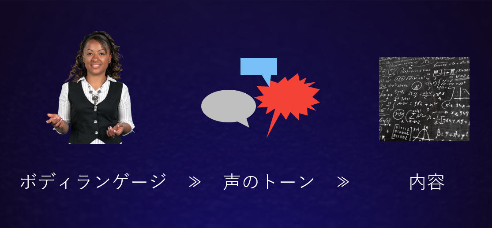

傾聴は、カール・ロジャースが創始した[来談者中心療法](https://meshb.nlm.nih.gov/record/ui?ui=D009629)の中核的な考え方をコミュニケーションの技法としてシンプルにしたものです。当初ロジャーズは心理カウンセリングにおいてカウンセラーが患者の問題を突き止め、指示を与えて回復させるにつなげるという方法を目指していましたが、それではほとんど効果が得られないことに気づき、むしろ**患者は自らの力で回復する潜在的な力を必ず持っている**ということを前提にした治療を行うようになりました。つまり「治そう」「治そう」という姿勢で患者に接するのではなく、患者の言うことをたとえ奇妙であったり間違っていたりしていると感じても肯定的に受け取り、治療プロセスの主導権を患者に持ってもらうように導きます。すると患者は自分自身を次第に受け入れられるようになり、その結果自力で立ち直っていきます。  

このような考えに基づけば「患者」という言葉は適切ではないため、患者の代わりにクライアント（来談者）という言葉が使われるようになり、来談者中心療法は最終的には**パーソンセンタードアプローチ**と呼ばれるようになりました。

現在では傾聴はブレインストーミングやコーチングにも応用されています。これらは個人の心理的な問題を解決するという目的は持っておらず、

## 傾聴パートでおこなうこと

* 開いた質問をする
* より詳しい説明を促す
* 関心を持ちつづける
* 要約する

* パラフレーズ
* 感情に共感する
* 確認の質問をする