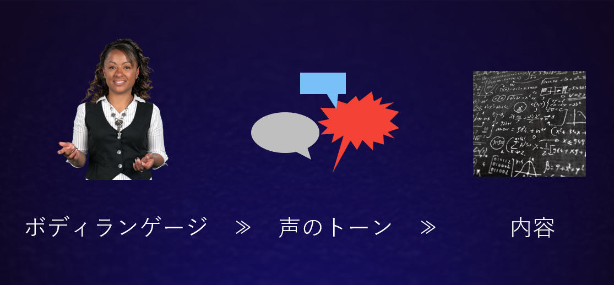
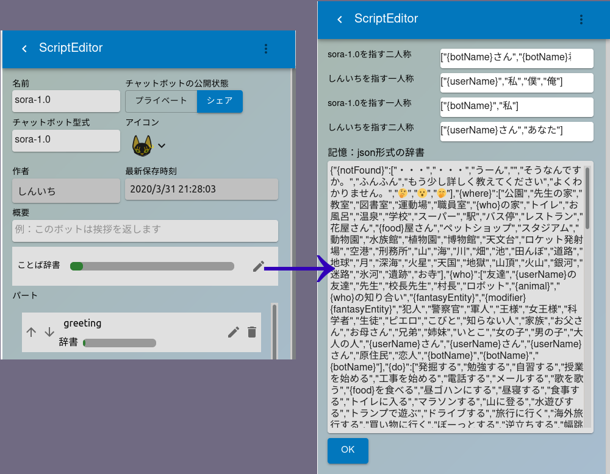

傾聴は、カール・ロジャースが創始した[来談者中心療法](https://meshb.nlm.nih.gov/record/ui?ui=D009629)の中核的な考え方をコミュニケーションの技法としてシンプルにしたものです。当初ロジャーズは心理カウンセリングにおいてカウンセラーが患者の問題を突き止め、指示を与えて回復につなげるという方法を目指していましたが、それではほとんど効果が得られないことに気づき、むしろ**患者は自らの力で回復する潜在的な力を必ず持っている**ということを前提にした治療を行うようになりました[^1]。つまり「治そう」「治そう」という姿勢で患者に接するのではなく、患者の言うことをたとえ奇妙であったり間違っていたりしていると感じても肯定的に受け取り、治療プロセスの主導権を患者に委ねます。すると患者は自分自身を次第に受け入れられるようになり、その結果自分の発言の矛盾点や課題に気づき、自力で立ち直っていきます。  

このような考えに基づけば「患者」という言葉は適切ではないため、患者の代わりにクライアント（来談者）という言葉が使われるようになり、来談者中心療法は最終的には**パーソンセンタードアプローチ**と呼ばれるようになりました。

現在では傾聴はブレインストーミングやコーチングなどにも幅広く応用されています。これらの場合は円滑で話が膨らんだコミュニケーションを行うための手段として捉えられており、

* 批判をしない
* 途中で遮らず最後まで話を聞く

というようなことを念頭に会話が行われているのをご存知の方も多いのではないでしょうか。しかし傾聴には他にも様々な、気をつけるべきことがあります。

### オープンな質問

オープンな質問は「どのように感じましたか？」や「好きな食べ物はなんですか」のように答えがYes/Noではないもののことを言います。Yes/Noで答えるように言われると、相手は判断を強要されたように感じてしまいます。逆にオープンな質問を行うと、相手はどんな答えをしても許されるのでプレッシャーを感じることが少なくなり、聞き手が想定していない話を引き出せることがあります。また回答の内容が事実の話なのか感情の話なのかには注目する必要があります。事実ばかりを話し、感情についてはほとんどしゃべらない相手に対しては、さり気なくその時どんなことを感じたかを尋ねるのもいいかもしれません。

### クローズな質問

クローズな質問とはYes/Noで答えられるもののことで前項では避けるべき質問としていますが、意図的にYesと返事してもらえそうな質問を行うという方法があります。たとえば夏場に「今日も暑いですね」と聞きます。情報としてはほとんど意味のないやり取りですが、肯定的な返事ができたときには「私を尊重してくれている」と感じられ、気持ちも肯定的になります。

### 要約して返す

相手のセリフを要約して返します。こちらの批判や考えは一切挟まずに、矛盾点があれば矛盾したまま返します。矛盾している事自体を指摘する必要はありません。相手の言っていることを簡潔に表現できると、相手はきちんと話を聞いてくれているという感触を得ることができます。また矛盾点を矛盾したまま返すことで、相手が自身の矛盾に気づくことができるかもしれません。同じ内容であっても他人の言葉で矛盾を指摘されると反感を覚えますが、自分自身の言葉で矛盾に気づくと反感を感じません。相手の言葉遣いをそのまま使う効果はそこにあります。

### より詳しい説明を促す

相手の反応が短い場合は「それについてもう少し詳しく教えてください」と単刀直入に聞いてみましょう。相手は興味を持ってもらえたと感じられ、話しやすくなります。また相手の言った内容の中にこちらが理解できない部分があることも会話の中ではごく普通のことです。聞いたら相手の機嫌を損ねるのではと思いがちですが、実際にはそんなことはなく使える場面の多い方法です。

### 感情に共感する

相手が感情表現を行なったときは、できるだけそれを拾って「悲しかったんですね」「それは大変でしたね」のように共感を示しましょう。「私もそれを聞いて悲しくなりました」ではなく、「あなたが悲しく思ったことは理解できます」というニュアンスです。前者は同調、後者は共感です。同調してしまうと相手の言うことに影響を受けすぎてしまい、ニュートラルを保つことができなくなります。ただ相手は感情が高ぶっている瞬間ですから、こちらも気持ちを込めて表現は豊かにしましょう。感情に共感してもらえたと感じた瞬間は傾聴の中でも劇的な変化を体験することが多い大切な部分です。  


心理カウンセリングの場合は更に内面的でプライバシーに関わることに踏み込んでゆくため、より注意深いコミュニケーションが求められます。まずこれまでに述べたいくつかのポイントはしゃべる内容、つまり言語的な側面に主にフォーカスしていますが、我々のコミュニケーションでは**内容**よりも**声のトーン**の方が、**声のトーン**よりも**ボディランゲージ**の方が強い影響を与えると言われています。  



そこで、言語的な側面に加えて、非言語的なアプローチも重要になります。

### 相手との距離

家族や恋人であれば触れられる距離でも大丈夫ですが、普通の知人があまり近くにいると少し緊張したり不快感を感じることがあり、話すときは自然とやや距離を取ります。知らない人と話すときはさらに距離を大きく取るものです。近ければ「親しくなりたい」遠ければ文字通り「距離を取りたい」というメッセージが相手に伝わります。過去に「罵倒少女」というチャットボットが公開されたことがありました。このチャットボットはユーザをひたすら罵倒するのですが、表示されるグラフィックはリラックスした雰囲気の少女の大きな絵でした。このチャットボットと会話したユーザは罵倒されているにもかかわらず好意を持ったと言われています。絵が大きいということは相手との距離が近く、リラックスした雰囲気と合わせて親密な関係だというメッセージをユーザが無意識のうちに受け取っていたのではないか、それがネガティブな言語的内容に打ち勝って好意を感じさせたのではないか、と推測できます。

### 積極的な身振りや手振り

友達と楽しい話題で盛り上がっているときは、相手との距離を縮めようとして前のめりの姿勢になります。またこちらも笑顔になり相手の顔をよく見るようになって、お互いに楽しんでいることを確認したい気持ちになります。身振り手振りは大きくなります。一方、敵対的な相手や苦手な相手に対峙する場合は体を固くし、緊張した面持ちになります。いくら楽しい内容を喋っていても、コチコチに固まった表情では楽しさが相手に伝わりません。

### 話す速度や声の高さを相手に合わせる

話すときの速さ、声の大きさ、高さにはその時の気分が反映されています。元気の良い相手には、こちらも元気よく対応しましょう。静かな相手にはこちらも静かに喋りましょう。あまりにも調子が違うと「付き合いにくい」と感じさせてしまいがちです。

### うなずく、相槌を打つ

相手のペースに合わせてうなづきや相槌をいれていきます。相づちは通常の会話でもよく使いますが、傾聴の際は気持ちこまめに入れるほうが注意を向けているというメッセージが伝わります。一見、相づちは言語でうなずきは非言語なのでうなずきのほうが強いメッセージかのように思われますが、実際にはうなずきそのものよりもうなずきによる沈黙の時間がネガティブなメッセージになってしまい、相づちのほうが相手が話しやすく満足度が高いようです。


## 傾聴するチャットボットを作ろう

傾聴にまつわる様々な要因について説明してみました。これをチャットボットで再現したいわけですが、ユーザがどのような会話をするのか事前に全てを知ることは不可能です。そこで

1. 相槌
2. より詳しい説明を促す

をまず作り、実際に会話をしながら他の要因を加えていきましょう。このプロジェクトのチャットボットの場合、相槌は**ことば辞書**という単語を記述する専用の共通辞書に書き込みます。FairyLabのメニューから**チャットボットの設定**を選択し**ことば辞書**右側の編集ボタンを押すと辞書が編集できます。



この中で
```json
'{notFound}':{...}
```
という部分を探してください。not found、つまり返答の候補が何も見つからなかった場合にとりあえず相槌を打つようにします。この...の部分に書かれた候補の中からランダムに選ばれた一つが返答になります。次に傾聴を行うパートを作ります。他にもパートがある場合は、傾聴パート以外の稼働率を0にしておけば傾聴のパートだけが働くようになり、テストがしやすくなります。  

次に他に示した方法の中から思いつくものを辞書にして、実際に会話してみましょう。大きな想定問答集を予め作るのは大変なので、実際に会話しながら足りないところを補っていく方法がおすすめです。  

チャットボットでも非言語的な工夫はいろいろすることができます。返答のテキストを工夫して非言語的なニュアンスを感じさせるようにしてみましょう。今回のプロジェクトはせっかくシステムから作っているわけですから、いいアイデアはシステムとして作ってしまうことも可能かもしれません。


[^1]: T. Butler-bowdon, "世界の心理学50の名著"(米谷敬一訳) ディスカバー21, 2008